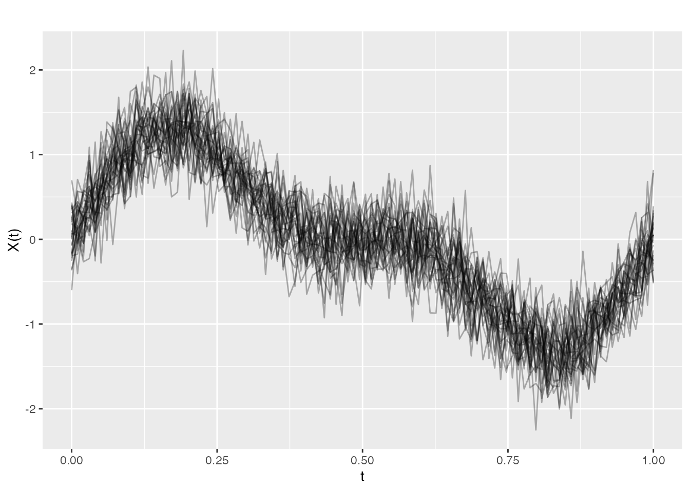
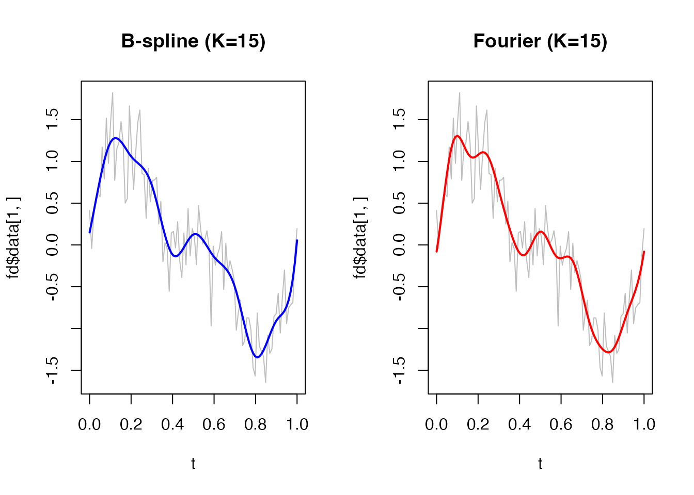
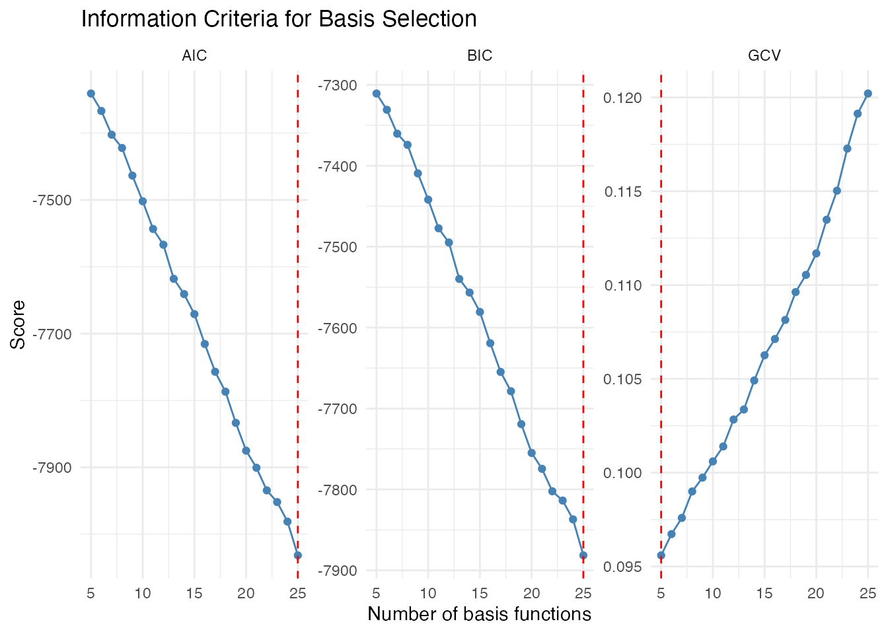
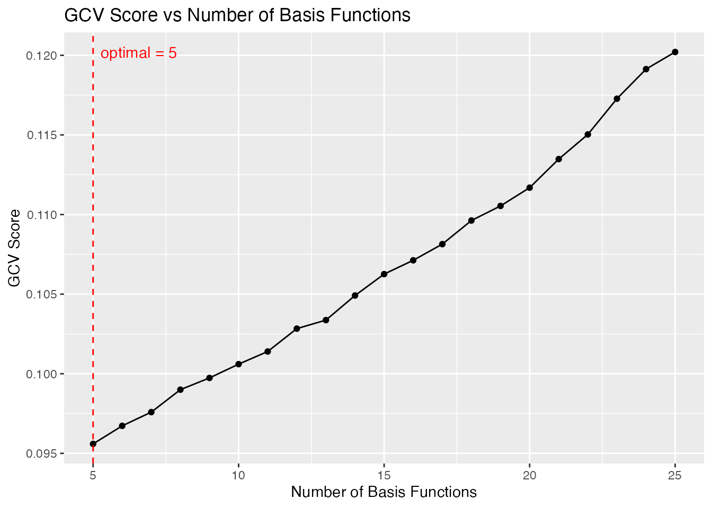
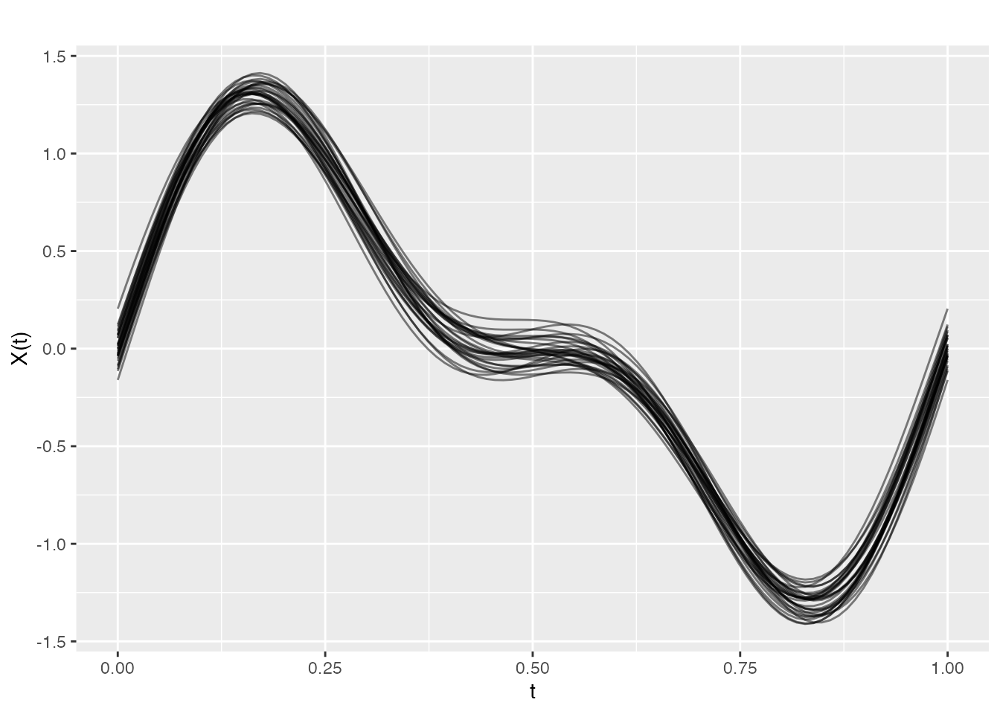
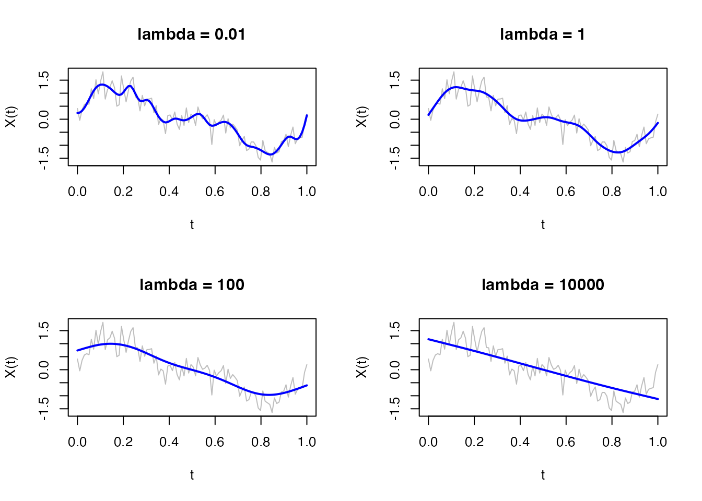
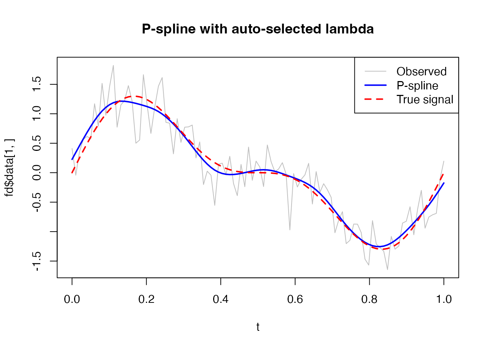
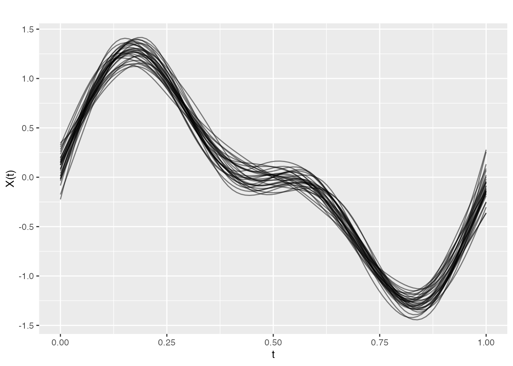
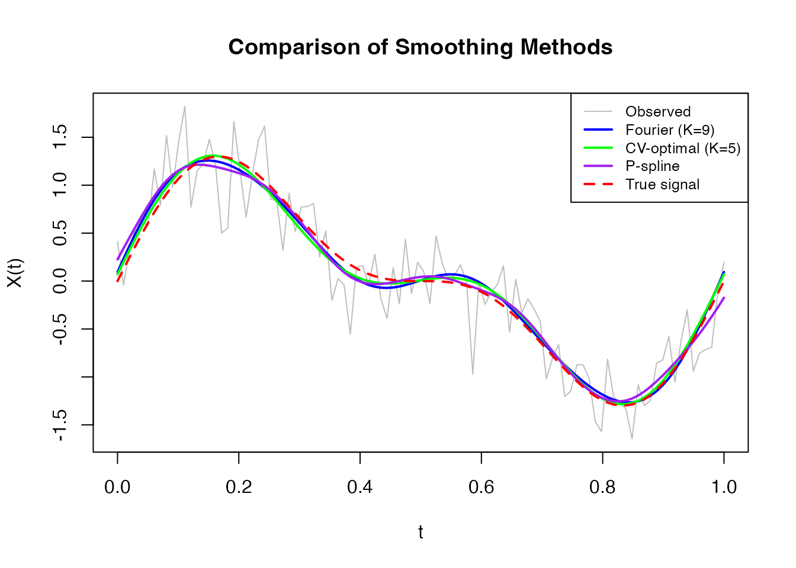

# Finding the Best Basis Representation

## Introduction

Basis representation is fundamental in functional data analysis. Instead
of working with raw observations at discrete points, we represent curves
as linear combinations of basis functions:

$$X(t) = \sum\limits_{k = 1}^{K}c_{k}B_{k}(t)$$

where $B_{k}(t)$ are basis functions and $c_{k}$ are coefficients.

This approach provides:

- **Smoothing**: Reduces noise by projecting onto a lower-dimensional
  space
- **Dimensionality reduction**: Represents infinite-dimensional
  functions with finite coefficients
- **Regularization**: Controls curve smoothness through basis choice and
  penalties

**fdars** provides tools to find the optimal basis representation for
your data.

``` r
library(fdars)
#> 
#> Attaching package: 'fdars'
#> The following objects are masked from 'package:stats':
#> 
#>     cov, deriv, median, sd, var
#> The following object is masked from 'package:base':
#> 
#>     norm
set.seed(42)
```

## Creating Example Data

Let’s create functional data with a known signal plus noise:

``` r
# Generate noisy functional data
t <- seq(0, 1, length.out = 100)
n <- 30  # number of curves

# True underlying signal: mixture of sin waves
true_signal <- function(t) sin(2 * pi * t) + 0.5 * sin(4 * pi * t)

# Generate noisy observations
X <- matrix(0, n, length(t))
for (i in 1:n) {
  X[i, ] <- true_signal(t) + rnorm(length(t), sd = 0.3)
}
fd <- fdata(X, argvals = t)

# Plot the data
plot(fd, alpha = 0.3)
```



## Choosing a Basis Type

**fdars** supports two main basis types:

### B-splines (default)

- Best for **non-periodic** data
- Local support: each basis function is non-zero only in a limited
  region
- Good for capturing local features
- Computationally efficient

### Fourier Basis

- Best for **periodic** data (cycles, seasonal patterns)
- Global support: each basis function spans the entire domain
- Natural for data with harmonic structure

``` r
# Compare B-spline and Fourier representations
coefs_bspline <- fdata2basis(fd, nbasis = 15, type = "bspline")
coefs_fourier <- fdata2basis(fd, nbasis = 15, type = "fourier")

# Reconstruct
fd_bspline <- basis2fdata(coefs_bspline, argvals = t, type = "bspline")
fd_fourier <- basis2fdata(coefs_fourier, argvals = t, type = "fourier")

# Plot comparison for first curve
par(mfrow = c(1, 2))
plot(t, fd$data[1, ], type = "l", col = "gray", main = "B-spline (K=15)")
lines(t, fd_bspline$data[1, ], col = "blue", lwd = 2)

plot(t, fd$data[1, ], type = "l", col = "gray", main = "Fourier (K=15)")
lines(t, fd_fourier$data[1, ], col = "red", lwd = 2)
```



``` r
par(mfrow = c(1, 1))
```

For our sinusoidal data, Fourier basis is more natural since the true
signal is composed of sine waves.

## Selecting the Number of Basis Functions

The key question: **How many basis functions should we use?**

- Too few: Underfitting (misses important features)
- Too many: Overfitting (fits noise)

### Information Criteria

**fdars** provides three criteria to evaluate basis representations:

| Criterion | Formula                            | Penalizes                    |
|-----------|------------------------------------|------------------------------|
| GCV       | $\frac{RSS/n}{(1 - edf/n)^{2}}$    | Effective degrees of freedom |
| AIC       | $n\log(RSS/n) + 2 \cdot edf$       | Model complexity (moderate)  |
| BIC       | $n\log(RSS/n) + \log(n) \cdot edf$ | Model complexity (strong)    |

``` r
# Compute criteria for different nbasis values
nbasis_range <- 5:25

gcv_scores <- sapply(nbasis_range, function(k) basis.gcv(fd, nbasis = k, type = "fourier"))
aic_scores <- sapply(nbasis_range, function(k) basis.aic(fd, nbasis = k, type = "fourier"))
bic_scores <- sapply(nbasis_range, function(k) basis.bic(fd, nbasis = k, type = "fourier"))

# Plot the criteria
par(mfrow = c(1, 3))
plot(nbasis_range, gcv_scores, type = "b", xlab = "Number of basis", ylab = "GCV",
     main = "GCV Score")
abline(v = nbasis_range[which.min(gcv_scores)], col = "red", lty = 2)

plot(nbasis_range, aic_scores, type = "b", xlab = "Number of basis", ylab = "AIC",
     main = "AIC Score")
abline(v = nbasis_range[which.min(aic_scores)], col = "red", lty = 2)

plot(nbasis_range, bic_scores, type = "b", xlab = "Number of basis", ylab = "BIC",
     main = "BIC Score")
abline(v = nbasis_range[which.min(bic_scores)], col = "red", lty = 2)
```



``` r
par(mfrow = c(1, 1))

cat("Optimal nbasis - GCV:", nbasis_range[which.min(gcv_scores)], "\n")
#> Optimal nbasis - GCV: 5
cat("Optimal nbasis - AIC:", nbasis_range[which.min(aic_scores)], "\n")
#> Optimal nbasis - AIC: 25
cat("Optimal nbasis - BIC:", nbasis_range[which.min(bic_scores)], "\n")
#> Optimal nbasis - BIC: 25
```

**Interpretation:**

- **GCV** (Generalized Cross-Validation): Often a good default, balances
  fit and complexity
- **AIC**: Tends to select slightly more complex models
- **BIC**: More conservative, penalizes complexity more strongly for
  larger samples

### Automatic Selection with `fdata2basis.cv()`

For convenience, use
[`fdata2basis.cv()`](https://sipemu.github.io/fdars/reference/fdata2basis.cv.md)
to automatically find the optimal number of basis functions:

``` r
# Automatic selection using GCV
cv_result <- fdata2basis.cv(fd, nbasis.range = 5:25, type = "fourier", criterion = "GCV")
print(cv_result)
#> Basis Cross-Validation Results
#> ==============================
#> Criterion: GCV 
#> Optimal nbasis: 5 
#> Score at optimal: 0.09559293 
#> Range tested: 5 - 25

# Visualize the selection
plot(cv_result)
```



The function returns the optimal number of basis functions and the
fitted curves:

``` r
# Plot the smoothed data
plot(cv_result$fitted, alpha = 0.5, main = paste("Smoothed with", cv_result$optimal.nbasis, "Fourier basis"))
```



### K-fold Cross-Validation

For a more robust estimate, use k-fold cross-validation:

``` r
# K-fold cross-validation (slower but more robust)
cv_kfold <- fdata2basis.cv(fd, nbasis.range = 5:25, type = "fourier",
                            criterion = "CV", kfold = 10)
print(cv_kfold$optimal.nbasis)
```

## P-spline Smoothing

P-splines (Penalized B-splines) offer an alternative approach: instead
of selecting the number of basis functions, we use many basis functions
but add a roughness penalty:

$$\text{minimize}\quad{||}y - Bc{||}^{2} + \lambda c\prime D\prime Dc$$

where: - $B$ is the B-spline basis matrix - $c$ are coefficients - $D$
is a difference matrix (controls smoothness) - $\lambda$ is the penalty
parameter

``` r
# Fit P-spline with fixed lambda
result_fixed <- pspline(fd[1], nbasis = 25, lambda = 10)
print(result_fixed)
#> P-spline Smoothing Results
#> ==========================
#> Number of curves: 1 
#> Number of basis functions: 25 
#> Penalty order: 2 
#> Lambda: 1e+01 
#> Effective df: 7.95 
#> GCV: 1.082e-01

# Compare different lambda values
par(mfrow = c(2, 2))
for (lam in c(0.01, 1, 100, 10000)) {
  result <- pspline(fd[1], nbasis = 25, lambda = lam)
  plot(t, fd$data[1, ], type = "l", col = "gray",
       main = paste("lambda =", lam), ylab = "X(t)")
  lines(t, result$fdata$data[1, ], col = "blue", lwd = 2)
}
```



``` r
par(mfrow = c(1, 1))
```

### Automatic Lambda Selection

P-splines can automatically select the optimal smoothing parameter:

``` r
# Automatic lambda selection using GCV
result_auto <- pspline(fd[1], nbasis = 25, lambda.select = TRUE, criterion = "GCV")
cat("Selected lambda:", result_auto$lambda, "\n")
#> Selected lambda: 2.559548
cat("Effective df:", round(result_auto$edf, 2), "\n")
#> Effective df: 10.42

# Plot result
plot(t, fd$data[1, ], type = "l", col = "gray", main = "P-spline with auto-selected lambda")
lines(t, result_auto$fdata$data[1, ], col = "blue", lwd = 2)
lines(t, true_signal(t), col = "red", lty = 2, lwd = 2)
legend("topright", c("Observed", "P-spline", "True signal"),
       col = c("gray", "blue", "red"), lty = c(1, 1, 2), lwd = c(1, 2, 2))
```



### Smoothing Multiple Curves

P-splines work curve-by-curve, so you can smooth entire datasets:

``` r
# Smooth all curves with automatic lambda selection
result_all <- pspline(fd, nbasis = 25, lambda.select = TRUE)

# Plot smoothed data
plot(result_all$fdata, alpha = 0.5, main = "All curves smoothed with P-splines")
```



## Comparing Approaches

Let’s compare the different smoothing approaches:

``` r
# Original noisy data
fd_single <- fd[1]

# 1. Simple basis projection (Fourier)
coefs <- fdata2basis(fd_single, nbasis = 9, type = "fourier")
fd_fourier <- basis2fdata(coefs, argvals = t, type = "fourier")

# 2. Optimal basis via CV
cv_opt <- fdata2basis.cv(fd_single, nbasis.range = 5:20, type = "fourier")
fd_cv <- cv_opt$fitted

# 3. P-spline with automatic lambda
ps_result <- pspline(fd_single, nbasis = 25, lambda.select = TRUE)
fd_pspline <- ps_result$fdata

# Plot comparison
plot(t, fd_single$data[1, ], type = "l", col = "gray", lwd = 1,
     main = "Comparison of Smoothing Methods", ylab = "X(t)")
lines(t, fd_fourier$data[1, ], col = "blue", lwd = 2)
lines(t, fd_cv$data[1, ], col = "green", lwd = 2)
lines(t, fd_pspline$data[1, ], col = "purple", lwd = 2)
lines(t, true_signal(t), col = "red", lty = 2, lwd = 2)
legend("topright",
       c("Observed", "Fourier (K=9)", paste0("CV-optimal (K=", cv_opt$optimal.nbasis, ")"),
         "P-spline", "True signal"),
       col = c("gray", "blue", "green", "purple", "red"),
       lty = c(1, 1, 1, 1, 2), lwd = c(1, 2, 2, 2, 2), cex = 0.8)
```



## Recommendations

| Situation              | Recommended Approach              |
|------------------------|-----------------------------------|
| Periodic data          | Fourier basis with GCV selection  |
| Non-periodic data      | B-spline basis with GCV selection |
| Heavy noise            | P-splines with automatic lambda   |
| Fast processing needed | Simple basis with fixed K         |
| Publication-quality    | K-fold CV for robust selection    |

## Summary

1.  **Choose basis type** based on data characteristics:
    - Fourier for periodic patterns
    - B-splines for non-periodic data
2.  **Select complexity** using information criteria:
    - [`fdata2basis.cv()`](https://sipemu.github.io/fdars/reference/fdata2basis.cv.md)
      for automatic nbasis selection
    - [`basis.gcv()`](https://sipemu.github.io/fdars/reference/basis.gcv.md),
      [`basis.aic()`](https://sipemu.github.io/fdars/reference/basis.aic.md),
      [`basis.bic()`](https://sipemu.github.io/fdars/reference/basis.bic.md)
      for manual comparison
3.  **Consider P-splines** for:
    - Heavy noise scenarios
    - When you want smooth derivatives
    - Automatic smoothing parameter selection
4.  **Validate** by comparing reconstructed curves to the original data

## References

- Ramsay, J.O. and Silverman, B.W. (2005). *Functional Data Analysis*.
  Springer.
- Eilers, P.H.C. and Marx, B.D. (1996). Flexible smoothing with
  B-splines and penalties. *Statistical Science*, 11(2), 89-121.
