# Covariance Functions and Gaussian Process Generation

## Introduction

Covariance functions (also called kernels) are fundamental building
blocks for Gaussian processes. They define the correlation structure
between function values at different points, controlling properties like
smoothness and periodicity.

**fdars** provides a comprehensive set of covariance functions for
generating synthetic functional data from Gaussian processes.

``` r
library(fdars)
#> 
#> Attaching package: 'fdars'
#> The following objects are masked from 'package:stats':
#> 
#>     cov, deriv, median, sd, var
#> The following object is masked from 'package:base':
#> 
#>     norm
```

## Available Covariance Functions

### Gaussian (Squared Exponential)

The most common choice, producing infinitely differentiable (very
smooth) sample paths:
$$k(s,t) = \sigma^{2}\exp\left( - \frac{(s - t)^{2}}{2\ell^{2}} \right)$$

``` r
t <- seq(0, 1, length.out = 100)

# Create Gaussian covariance function
cov_gauss <- kernel_gaussian(variance = 1, length_scale = 0.2)
print(cov_gauss)
#> Covariance Kernel: gaussian 
#> Parameters:
#>    variance = 1 
#>    length_scale = 0.2

# Generate smooth GP samples
fd_gauss <- make_gaussian_process(n = 10, t = t, cov = cov_gauss, seed = 42)
plot(fd_gauss, main = "Gaussian Covariance (smooth)")
```

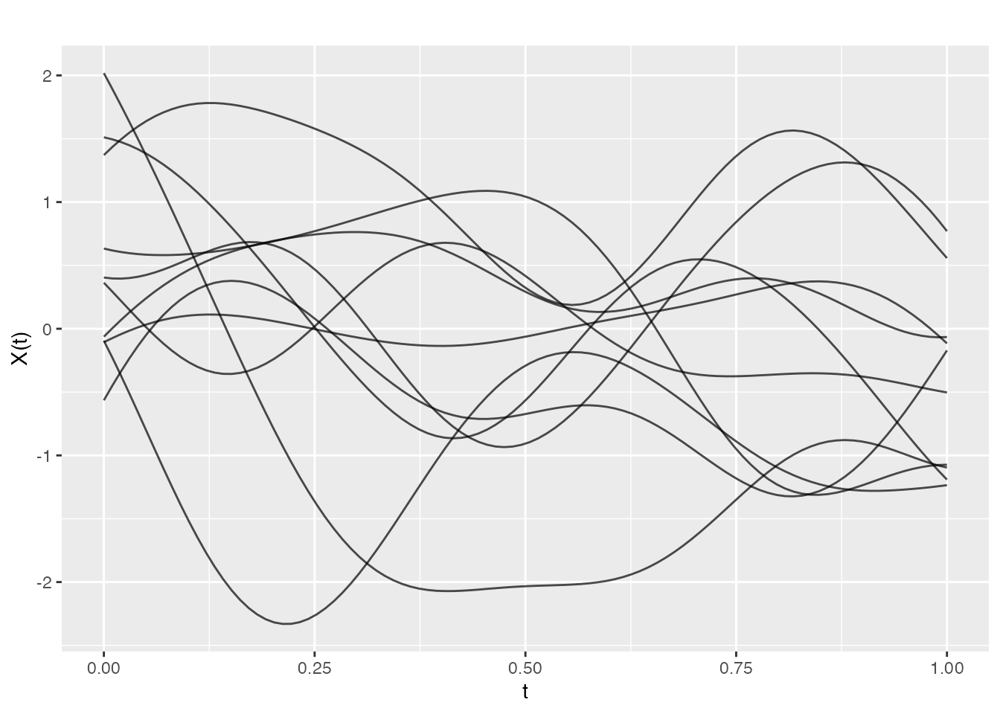

The `length_scale` parameter controls the correlation distance - smaller
values produce more rapidly varying functions:

``` r
par(mfrow = c(1, 3))
for (ls in c(0.05, 0.2, 0.5)) {
  fd <- make_gaussian_process(n = 5, t = t,
                              cov = kernel_gaussian(length_scale = ls),
                              seed = 42)
  plot(fd, main = paste("length_scale =", ls))
}
par(mfrow = c(1, 1))
```

### Exponential

Produces rougher paths than Gaussian (continuous but not
differentiable):
$$k(s,t) = \sigma^{2}\exp\left( - \frac{|s - t|}{\ell} \right)$$

``` r
cov_exp <- kernel_exponential(variance = 1, length_scale = 0.2)
fd_exp <- make_gaussian_process(n = 10, t = t, cov = cov_exp, seed = 42)
plot(fd_exp, main = "Exponential Covariance (rough)")
```

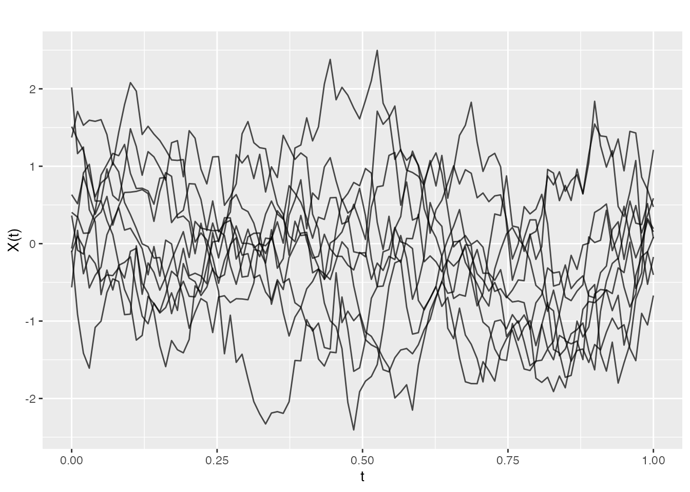

### Matern Family

The Matern covariance is parameterized by smoothness parameter $\nu$. It
interpolates between Exponential ($\nu = 0.5$) and Gaussian
($\left. \nu\rightarrow\infty \right.$):

``` r
par(mfrow = c(2, 2))
for (nu in c(0.5, 1.5, 2.5, Inf)) {
  fd <- make_gaussian_process(n = 5, t = t,
                              cov = kernel_matern(length_scale = 0.2, nu = nu),
                              seed = 42)
  plot(fd, main = paste("Matern nu =", nu))
}
par(mfrow = c(1, 1))
```

Common choices are: - $\nu = 0.5$: Equivalent to Exponential (rough) -
$\nu = 1.5$: Once differentiable - $\nu = 2.5$: Twice differentiable -
$\nu = \infty$: Equivalent to Gaussian (infinitely smooth)

### Brownian Motion

Standard Brownian motion covariance: $$k(s,t) = \sigma^{2}\min(s,t)$$

``` r
cov_brown <- kernel_brownian(variance = 1)
fd_brown <- make_gaussian_process(n = 10, t = t, cov = cov_brown, seed = 42)
plot(fd_brown, main = "Brownian Motion")
```

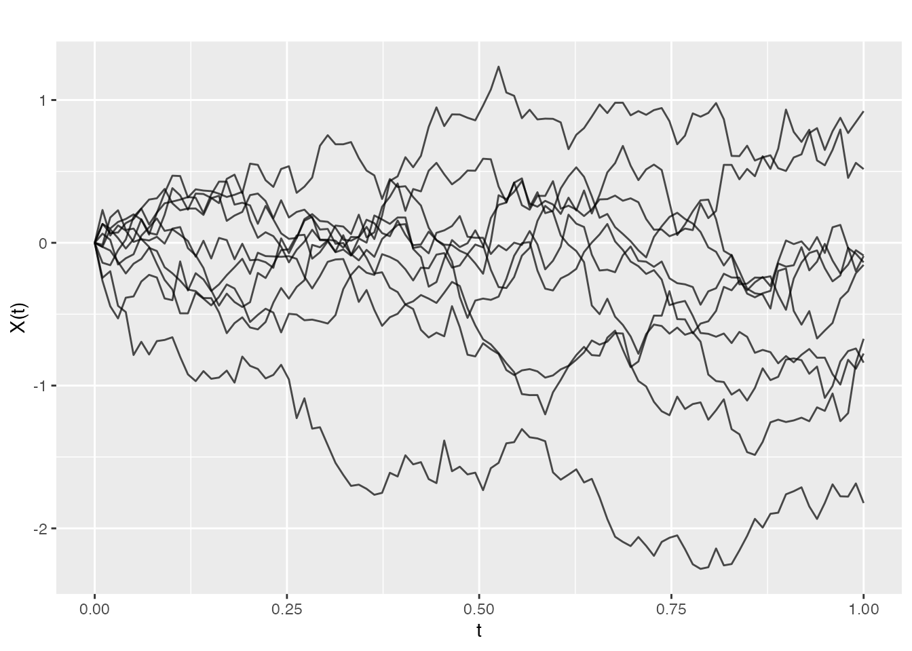

Note: Brownian covariance is only defined for 1D domains.

### Periodic

For data with periodic structure:
$$k(s,t) = \sigma^{2}\exp\left( - \frac{2\sin^{2}\left( \pi|s - t|/p \right)}{\ell^{2}} \right)$$

``` r
t_long <- seq(0, 3, length.out = 200)
cov_per <- kernel_periodic(variance = 1, length_scale = 0.5, period = 1)
fd_per <- make_gaussian_process(n = 5, t = t_long, cov = cov_per, seed = 42)
plot(fd_per, main = "Periodic Covariance (period = 1)")
```


### Linear

Linear covariance produces functions that are linear combinations of a
constant and a linear function: $$k(s,t) = \sigma^{2}(s \cdot t + c)$$

``` r
cov_lin <- kernel_linear(variance = 1, offset = 0)
fd_lin <- make_gaussian_process(n = 10, t = t, cov = cov_lin, seed = 42)
plot(fd_lin, main = "Linear Covariance")
```

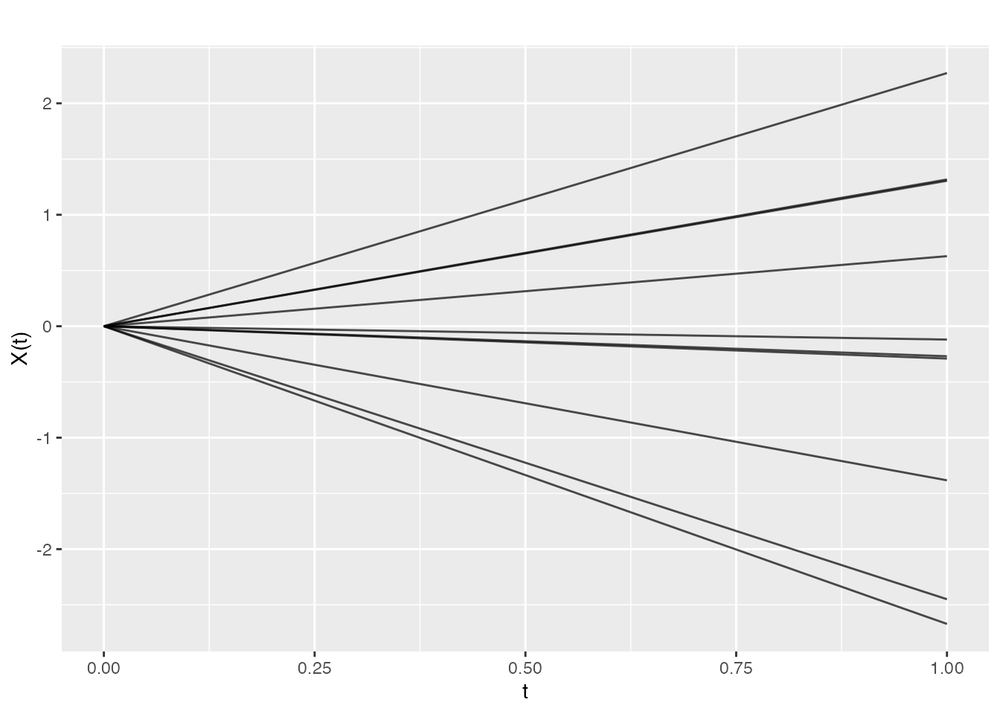

### Polynomial

Generalization of linear to polynomial basis functions:
$$k(s,t) = \sigma^{2}(s \cdot t + c)^{d}$$

``` r
cov_poly <- kernel_polynomial(variance = 1, offset = 1, degree = 3)
fd_poly <- make_gaussian_process(n = 10, t = t, cov = cov_poly, seed = 42)
plot(fd_poly, main = "Polynomial Covariance (degree 3)")
```

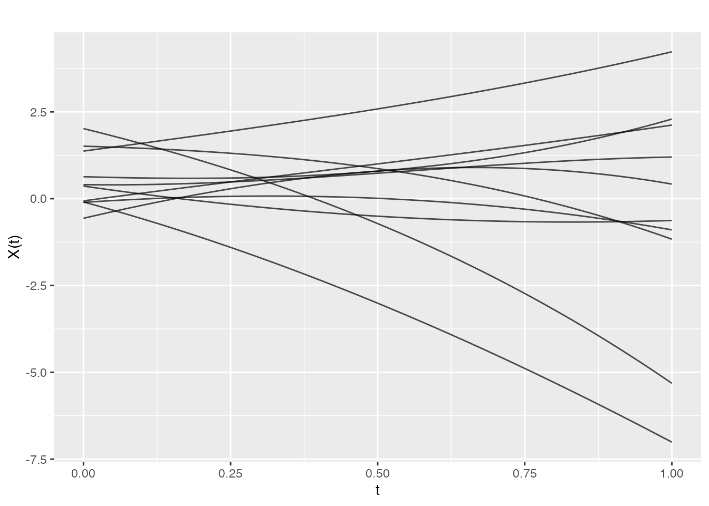

### White Noise

Diagonal covariance representing independent noise:
$$k(s,t) = \sigma^{2}\mathbf{1}_{s = t}$$

``` r
cov_white <- kernel_whitenoise(variance = 0.5)
fd_white <- make_gaussian_process(n = 5, t = t, cov = cov_white, seed = 42)
plot(fd_white, main = "White Noise")
```

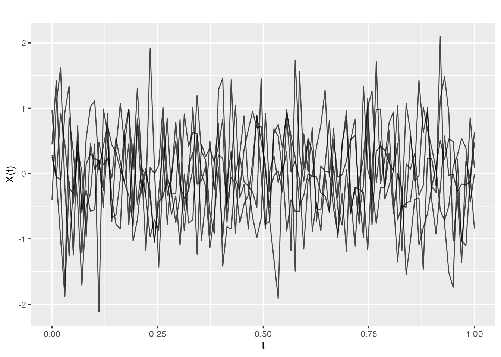

## Combining Covariance Functions

### Addition (kernel_add)

Sum of covariance functions models independent components:

``` r
# Signal + noise model
cov_signal <- kernel_gaussian(variance = 1, length_scale = 0.2)
cov_noise <- kernel_whitenoise(variance = 0.1)
cov_total <- kernel_add(cov_signal, cov_noise)

fd_noisy <- make_gaussian_process(n = 5, t = t, cov = cov_total, seed = 42)
plot(fd_noisy, main = "Smooth signal + noise")
```

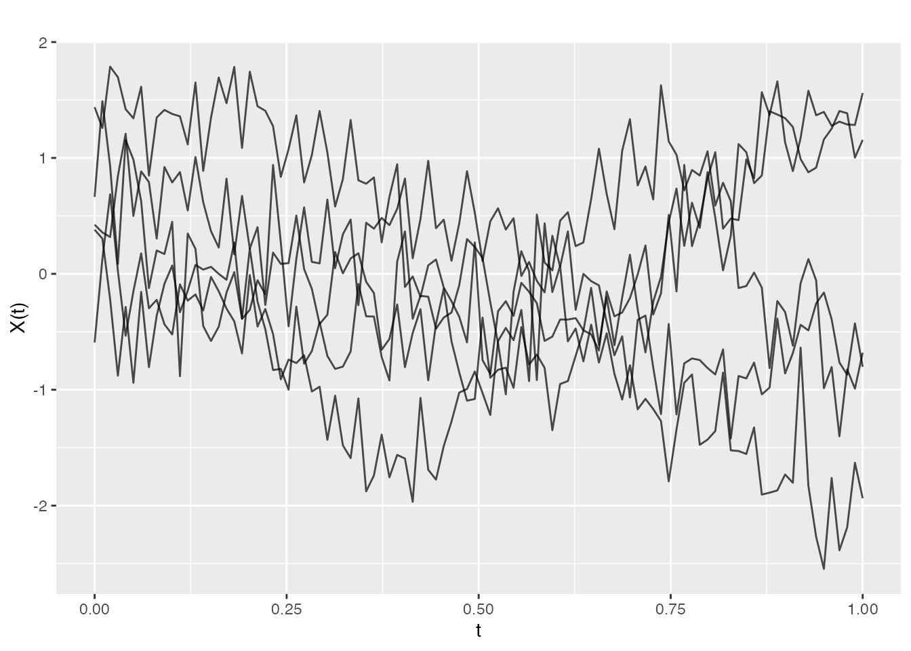

### Multiplication (kernel_mult)

Product of covariance functions:

``` r
# Locally periodic: smooth envelope modulating periodic behavior
cov_envelope <- kernel_gaussian(variance = 1, length_scale = 0.5)
cov_periodic <- kernel_periodic(period = 0.2)
cov_local_per <- kernel_mult(cov_envelope, cov_periodic)

fd_local_per <- make_gaussian_process(n = 5, t = t, cov = cov_local_per, seed = 42)
plot(fd_local_per, main = "Locally periodic")
```

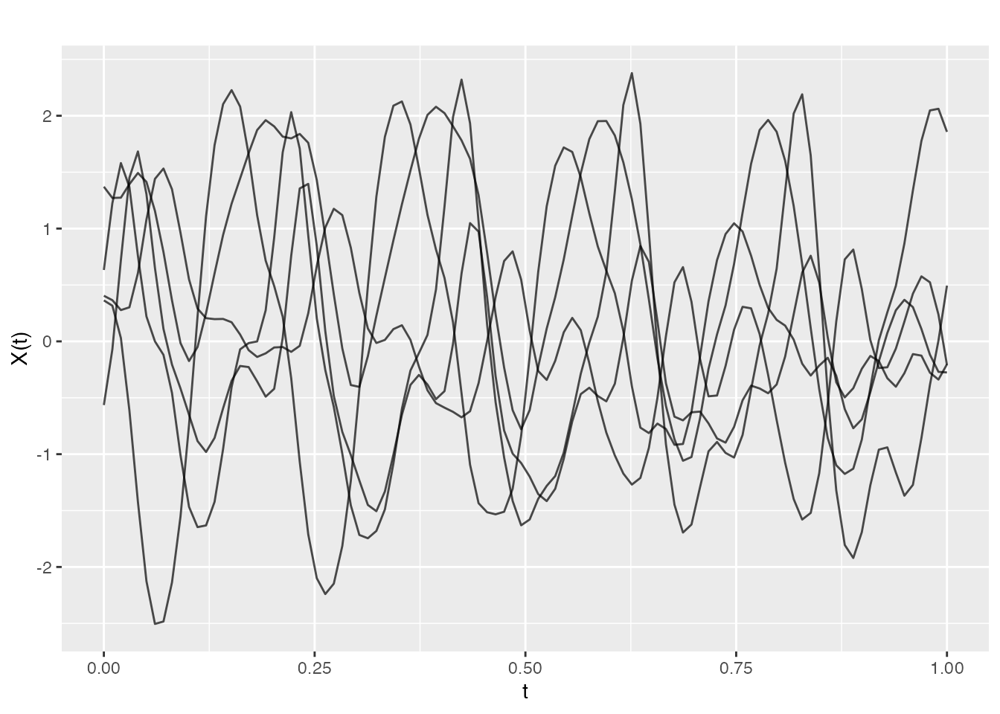

## Mean Functions

Gaussian processes can have non-zero mean functions:

``` r
# Scalar mean
fd_mean5 <- make_gaussian_process(n = 10, t = t,
                                   cov = kernel_gaussian(variance = 0.1),
                                   mean = 5, seed = 42)
plot(fd_mean5, main = "Constant mean = 5")
```

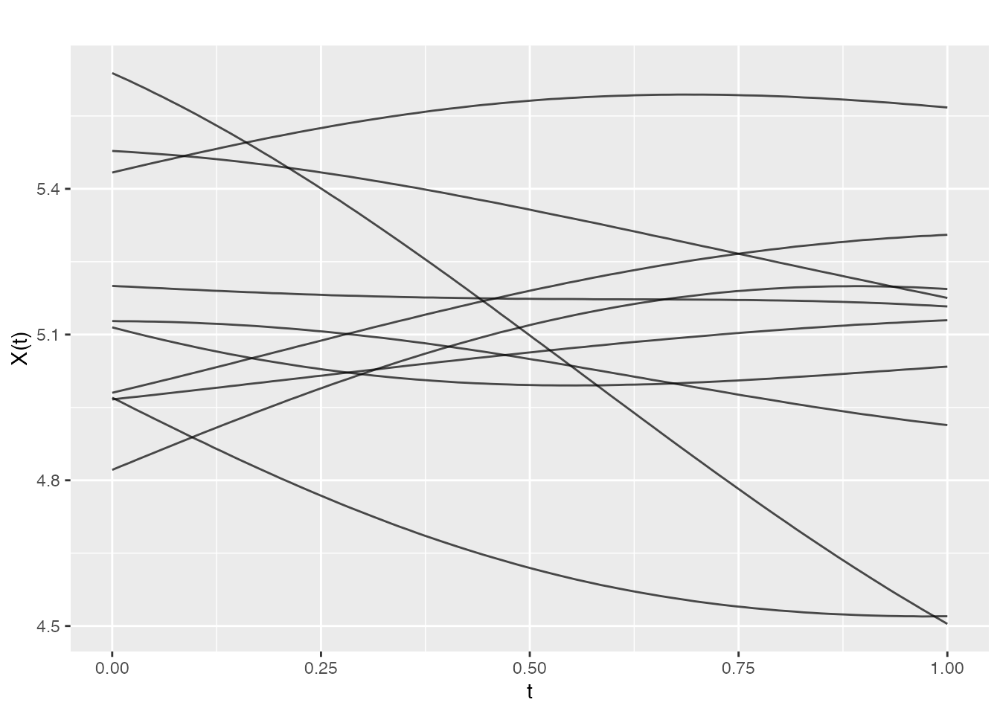

``` r

# Function mean
mean_func <- function(t) sin(2 * pi * t)
fd_sinmean <- make_gaussian_process(n = 10, t = t,
                                     cov = kernel_gaussian(variance = 0.1),
                                     mean = mean_func, seed = 42)
plot(fd_sinmean, main = "Sinusoidal mean function")
```

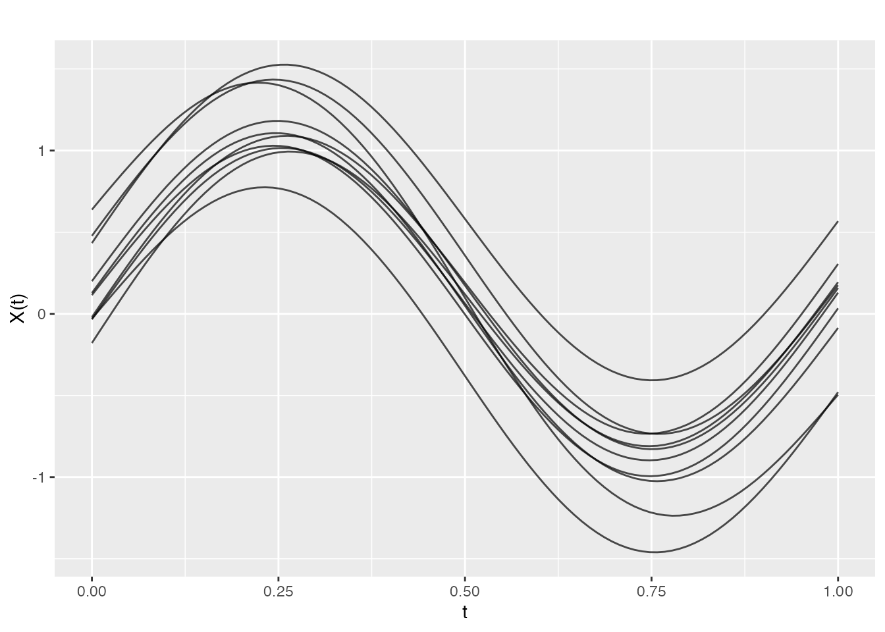

## 2D Functional Data (Surfaces)

Covariance functions can generate 2D functional data (surfaces):

``` r
s <- seq(0, 1, length.out = 30)
t2d <- seq(0, 1, length.out = 30)

# Generate 2D GP samples
fd2d <- make_gaussian_process(n = 4, t = list(s, t2d),
                               cov = kernel_gaussian(length_scale = 0.3),
                               seed = 42)
plot(fd2d)
```

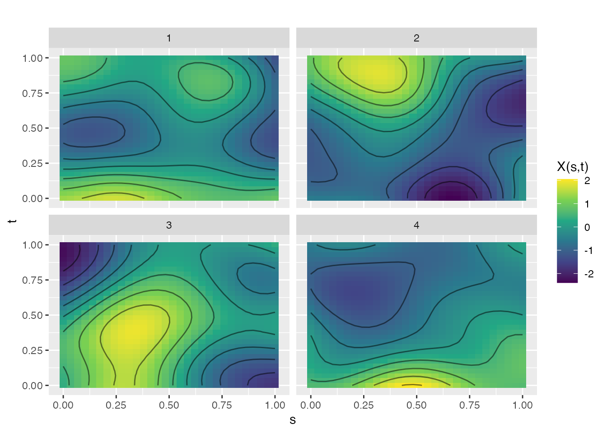

Note:
[`kernel_brownian()`](https://sipemu.github.io/fdars/reference/kernel_brownian.md)
and
[`kernel_periodic()`](https://sipemu.github.io/fdars/reference/kernel_periodic.md)
only support 1D domains.

## Reproducibility

Use the `seed` parameter for reproducible samples:

``` r
fd1 <- make_gaussian_process(n = 3, t = t, cov = kernel_gaussian(), seed = 123)
fd2 <- make_gaussian_process(n = 3, t = t, cov = kernel_gaussian(), seed = 123)
all.equal(fd1$data, fd2$data)  # TRUE
#> [1] TRUE
```

## Comparison of Smoothness

``` r
par(mfrow = c(2, 2))

fd_gauss <- make_gaussian_process(n = 3, t = t, cov = kernel_gaussian(), seed = 1)
plot(fd_gauss, main = "Gaussian (very smooth)")
```

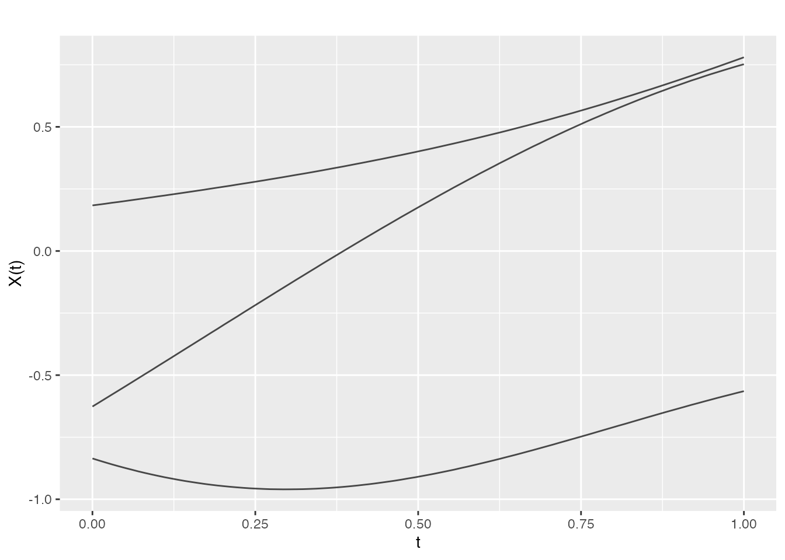

``` r

fd_mat25 <- make_gaussian_process(n = 3, t = t, cov = kernel_matern(nu = 2.5), seed = 1)
plot(fd_mat25, main = "Matern 5/2")
```

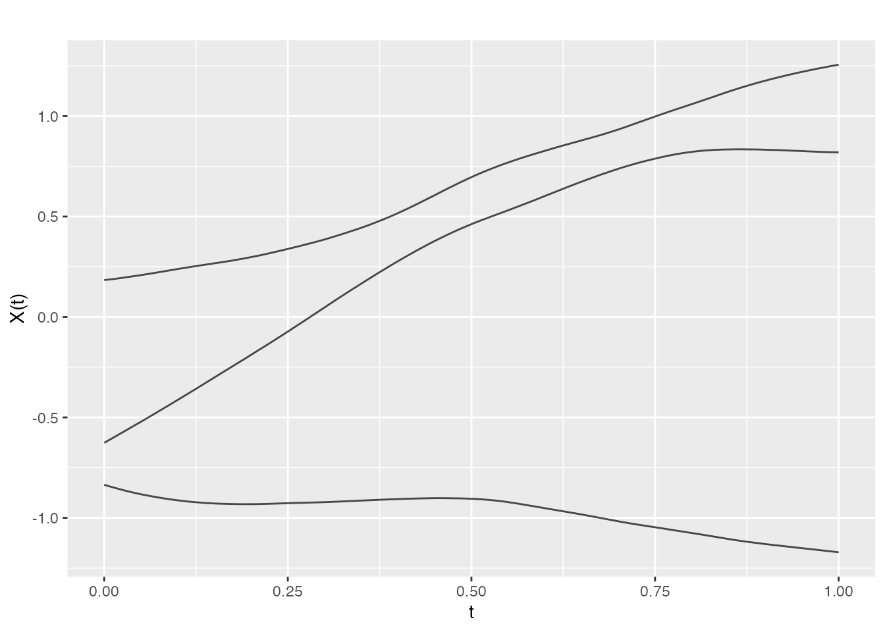

``` r

fd_mat15 <- make_gaussian_process(n = 3, t = t, cov = kernel_matern(nu = 1.5), seed = 1)
plot(fd_mat15, main = "Matern 3/2")
```

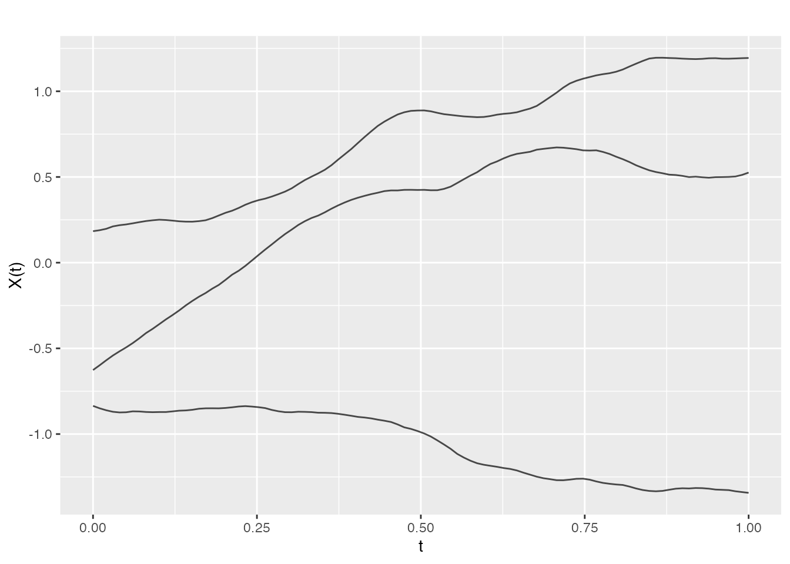

``` r

fd_exp <- make_gaussian_process(n = 3, t = t, cov = kernel_exponential(), seed = 1)
plot(fd_exp, main = "Exponential (rough)")
```

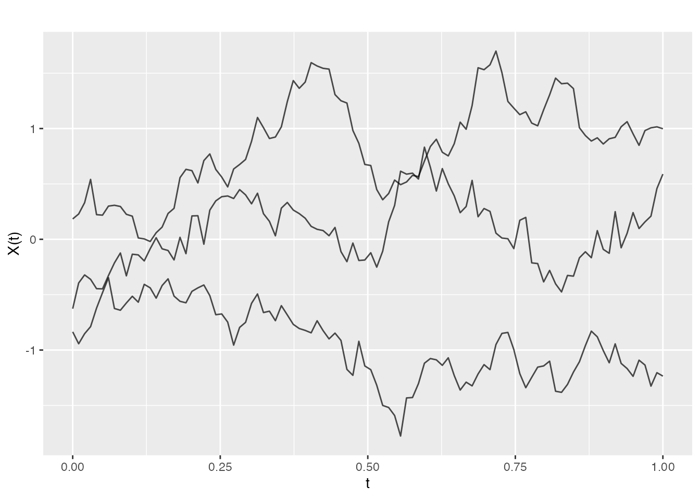

``` r

par(mfrow = c(1, 1))
```

## Summary Table

| Covariance  | Parameters                     | Smoothness                  | Notes                     |
|-------------|--------------------------------|-----------------------------|---------------------------|
| Gaussian    | variance, length_scale         | $C^{\infty}$                | Most common, very smooth  |
| Exponential | variance, length_scale         | $C^{0}$                     | Rough, non-differentiable |
| Matern      | variance, length_scale, nu     | $C^{\lbrack\nu - 1\rbrack}$ | Flexible smoothness       |
| Brownian    | variance                       | $C^{0}$                     | 1D only, non-stationary   |
| Linear      | variance, offset               | \-                          | Linear functions          |
| Polynomial  | variance, offset, degree       | \-                          | Polynomial functions      |
| WhiteNoise  | variance                       | \-                          | Independent noise         |
| Periodic    | variance, length_scale, period | $C^{\infty}$                | 1D only, periodic         |

## References

- Rasmussen, C.E. and Williams, C.K.I. (2006). *Gaussian Processes for
  Machine Learning*. MIT Press.
- Ramsay, J.O. and Silverman, B.W. (2005). *Functional Data Analysis*.
  Springer.
