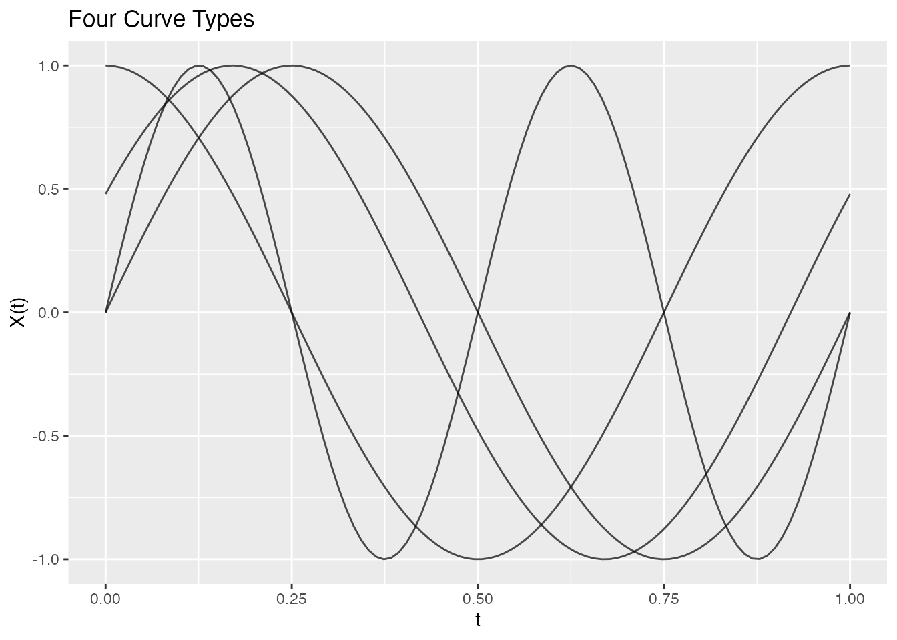
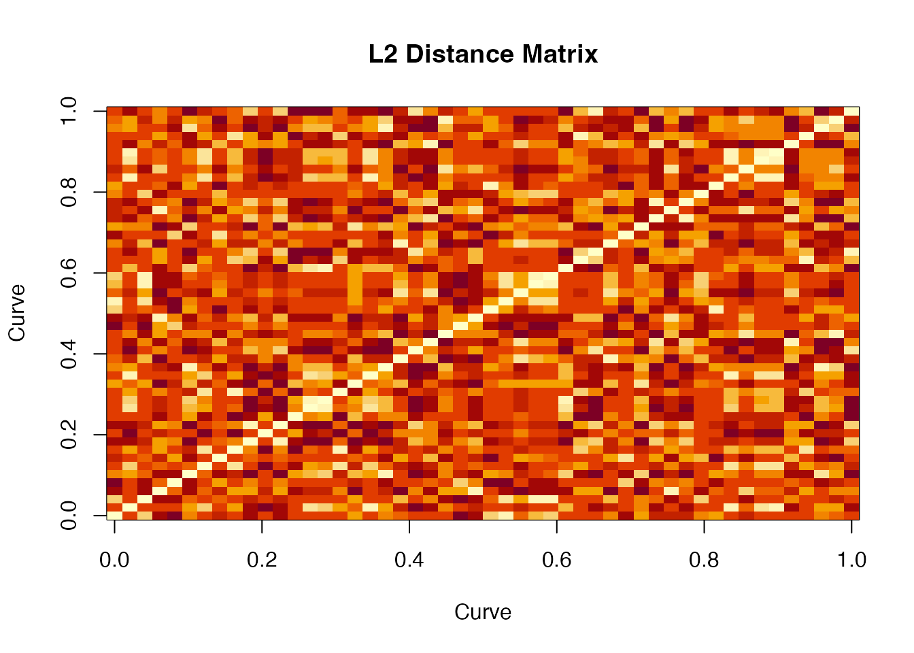

# Distance Metrics and Semimetrics

## Introduction

Distance measures are fundamental to many FDA methods including
clustering, k-nearest neighbors regression, and outlier detection.
**fdars** provides both true metrics (satisfying the triangle
inequality) and semimetrics (which may not).

``` r
library(fdars)
#> 
#> Attaching package: 'fdars'
#> The following objects are masked from 'package:stats':
#> 
#>     cov, deriv, median, sd, var
#> The following object is masked from 'package:base':
#> 
#>     norm

# Create example data with different curve types
set.seed(42)
m <- 100
t_grid <- seq(0, 1, length.out = m)

# Four types of curves
curve1 <- sin(2 * pi * t_grid)                    # Sine
curve2 <- sin(2 * pi * t_grid + 0.5)              # Phase-shifted sine
curve3 <- cos(2 * pi * t_grid)                    # Cosine
curve4 <- sin(4 * pi * t_grid)                    # Higher frequency

X <- rbind(curve1, curve2, curve3, curve4)
fd <- fdata(X, argvals = t_grid,
            names = list(main = "Four Curve Types"))
plot(fd)
```



## True Metrics

### Lp Distance (metric.lp)

The most common choice. Computes the integrated Lp norm of the
difference:
$$d_{p}(f,g) = \left( \int\left| f(t) - g(t) \right|^{p}dt \right)^{1/p}$$

``` r
# L2 (Euclidean) distance - default
dist_l2 <- metric.lp(fd)
print(as.matrix(dist_l2))
#>          curve1    curve2    curve3 curve4
#> curve1 0.000000 0.3498820 1.0000000      1
#> curve2 0.349882 0.0000000 0.7215085      1
#> curve3 1.000000 0.7215085 0.0000000      1
#> curve4 1.000000 1.0000000 1.0000000      0

# L1 (Manhattan) distance
dist_l1 <- metric.lp(fd, p = 1)

# L-infinity (maximum) distance
dist_linf <- metric.lp(fd, p = Inf)
```

The L2 distance is most common, but L1 is more robust to outliers, and
L-infinity focuses on the maximum difference.

### Weighted Lp Distance

Apply different weights to different parts of the domain:

``` r
# Weight emphasizing the middle of the domain
w <- dnorm(t_grid, mean = 0.5, sd = 0.2)
w <- w / sum(w) * length(w)  # Normalize

dist_weighted <- metric.lp(fd, p = 2, w = w)
```

### Hausdorff Distance (metric.hausdorff)

Treats curves as sets of points and computes the Hausdorff distance.
Useful when curves may cross or have different supports.

``` r
dist_haus <- metric.hausdorff(fd)
print(as.matrix(dist_haus))
#>           curve1    curve2    curve3    curve4
#> curve1 0.0000000 0.4794255 0.6775775 0.3280539
#> curve2 0.4794255 0.0000000 0.5205745 0.4160166
#> curve3 0.6775775 0.5205745 0.0000000 0.3521023
#> curve4 0.3280539 0.4160166 0.3521023 0.0000000
```

### Dynamic Time Warping (metric.DTW)

DTW allows for non-linear alignment of curves, making it robust to phase
shifts and time warping:

``` r
dist_dtw <- metric.DTW(fd)
print(as.matrix(dist_dtw))
#>           curve1    curve2    curve3   curve4
#> curve1  0.000000  1.452267 18.185014 24.84362
#> curve2  1.452267  0.000000  3.488397 25.97998
#> curve3 18.185014  3.488397  0.000000 40.82461
#> curve4 24.843625 25.979981 40.824607  0.00000
```

Notice that DTW gives a smaller distance between the original sine and
phase-shifted sine compared to L2, because it aligns them.

``` r
# Compare L2 vs DTW for phase-shifted curves
cat("L2 distance (sine vs phase-shifted):", as.matrix(dist_l2)[1, 2], "\n")
#> L2 distance (sine vs phase-shifted): 0.349882
cat("DTW distance (sine vs phase-shifted):", as.matrix(dist_dtw)[1, 2], "\n")
#> DTW distance (sine vs phase-shifted): 1.452267
```

DTW can use the Sakoe-Chiba band constraint to limit warping:

``` r
# Restrict warping to 10% of the series length
dist_dtw_band <- metric.DTW(fd, band = 0.1)
```

## Semimetrics

Semimetrics may not satisfy the triangle inequality but can be faster or
more appropriate for certain applications.

### PCA-Based Semimetric (semimetric.pca)

Distance based on principal component scores:

``` r
# Distance using first 3 PCs
dist_pca <- semimetric.pca(fd, ncomp = 3)
print(as.matrix(dist_pca))
#>           [,1]     [,2]      [,3]      [,4]
#> [1,]  0.000000 3.514139 10.000000  9.949874
#> [2,]  3.514139 0.000000  7.197768  9.961418
#> [3,] 10.000000 7.197768  0.000000 10.000000
#> [4,]  9.949874 9.961418 10.000000  0.000000
```

### Derivative-Based Semimetric (semimetric.deriv)

Distance based on derivatives, sensitive to curve shape:

``` r
# First derivative
dist_deriv1 <- semimetric.deriv(fd, nderiv = 1)

# Second derivative
dist_deriv2 <- semimetric.deriv(fd, nderiv = 2)
```

### Basis Semimetric (semimetric.basis)

Distance in the space of basis coefficients:

``` r
# B-spline basis
dist_bspline <- semimetric.basis(fd, nbasis = 15, type = "bspline")

# Fourier basis
dist_fourier <- semimetric.basis(fd, nbasis = 11, type = "fourier")
```

### Fourier Semimetric (semimetric.fourier)

Fast FFT-based distance using Fourier coefficients:

``` r
dist_fft <- semimetric.fourier(fd, nfreq = 5)
```

### Horizontal Shift Semimetric (semimetric.hshift)

Allows horizontal shifting to align curves before computing distance:

``` r
dist_hshift <- semimetric.hshift(fd)
```

### Kullback-Leibler Semimetric (metric.kl)

Symmetric KL divergence, treating curves as (normalized) density
functions:

``` r
# Shift curves to be positive for KL
X_pos <- X - min(X) + 0.1
fd_pos <- fdata(X_pos, argvals = t_grid)

dist_kl <- metric.kl(fd_pos)
```

## Unified Interface

Use [`metric()`](https://sipemu.github.io/fdars/reference/metric.md) for
a unified interface:

``` r
# Different methods via single function
d1 <- metric(fd, method = "lp", p = 2)
d2 <- metric(fd, method = "dtw")
d3 <- metric(fd, method = "hausdorff")
```

## Comparing Distance Measures

``` r
# Create comparison data
dists <- list(
  L2 = as.vector(as.matrix(dist_l2)),
  L1 = as.vector(as.matrix(dist_l1)),
  DTW = as.vector(as.matrix(dist_dtw)),
  Hausdorff = as.vector(as.matrix(dist_haus))
)

# Correlation between distance measures
dist_mat <- do.call(cbind, dists)
round(cor(dist_mat), 2)
#>             L2   L1  DTW Hausdorff
#> L2        1.00 1.00 0.82      0.74
#> L1        1.00 1.00 0.82      0.74
#> DTW       0.82 0.82 1.00      0.32
#> Hausdorff 0.74 0.74 0.32      1.00
```

## Distance Matrices for Larger Samples

``` r
# Generate larger sample
set.seed(123)
n <- 50
X_large <- matrix(0, n, m)
for (i in 1:n) {
  phase <- runif(1, 0, 2*pi)
  freq <- sample(1:3, 1)
  X_large[i, ] <- sin(freq * pi * t_grid + phase) + rnorm(m, sd = 0.1)
}
fd_large <- fdata(X_large, argvals = t_grid)

# Compute distance matrix
dist_matrix <- metric.lp(fd_large)

# Visualize as heatmap
image(as.matrix(dist_matrix), main = "L2 Distance Matrix",
      xlab = "Curve", ylab = "Curve")
```



## Choosing a Distance Measure

| Distance   | Properties                    | Best For                |
|------------|-------------------------------|-------------------------|
| L2         | Standard, fast                | General purpose         |
| L1         | Robust to outliers            | Heavy-tailed noise      |
| L-infinity | Focuses on maximum difference | Worst-case analysis     |
| DTW        | Handles phase shifts          | Time series alignment   |
| Hausdorff  | Set-based                     | Crossing curves         |
| PCA        | Dimension reduction           | High-dimensional        |
| Derivative | Shape-sensitive               | When derivatives matter |
| Fourier    | Very fast (FFT)               | Periodic data           |

## Performance

Distance computations are parallelized in Rust:

``` r
# Benchmark for 500 curves
X_bench <- matrix(rnorm(500 * 200), 500, 200)
fd_bench <- fdata(X_bench)

system.time(metric.lp(fd_bench))
#>    user  system elapsed
#>   0.089   0.000   0.045

system.time(metric.DTW(fd_bench))
#>    user  system elapsed
#>   1.234   0.000   0.312
```

## Using Distances in Other Methods

Distance functions can be passed to clustering and regression:

``` r
# K-means with L1 distance
km_l1 <- cluster.kmeans(fd_large, ncl = 3, metric = "L1", seed = 42)

# K-means with custom metric function
km_dtw <- cluster.kmeans(fd_large, ncl = 3, metric = metric.DTW, seed = 42)

# Nonparametric regression uses distances internally
y <- rnorm(n)
fit_np <- fregre.np(fd_large, y, metric = metric.lp)
```

## References

- Ferraty, F. and Vieu, P. (2006). *Nonparametric Functional Data
  Analysis*. Springer.
- Berndt, D.J. and Clifford, J. (1994). Using Dynamic Time Warping to
  Find Patterns in Time Series. *KDD Workshop*, 359-370.
