# Outlier Detection

## Introduction

Outlier detection in functional data identifies curves that are atypical
or anomalous compared to the rest of the sample. **fdars** provides
several methods based on functional depth and likelihood ratio tests.

``` r
library(fdars)
#> 
#> Attaching package: 'fdars'
#> The following objects are masked from 'package:stats':
#> 
#>     cov, deriv, median, sd, var
#> The following object is masked from 'package:base':
#> 
#>     norm
library(ggplot2)

# Generate normal data
set.seed(42)
n <- 30
m <- 100
t_grid <- seq(0, 1, length.out = m)

X <- matrix(0, n, m)
for (i in 1:n) {
  X[i, ] <- sin(2 * pi * t_grid) + rnorm(m, sd = 0.15)
}

# Add different types of outliers
X[1, ] <- sin(2 * pi * t_grid) + 2           # Magnitude outlier (shift up)
X[2, ] <- -sin(2 * pi * t_grid)              # Shape outlier (inverted)
X[3, ] <- sin(4 * pi * t_grid)               # Frequency outlier

fd <- fdata(X, argvals = t_grid)
plot(fd)
```

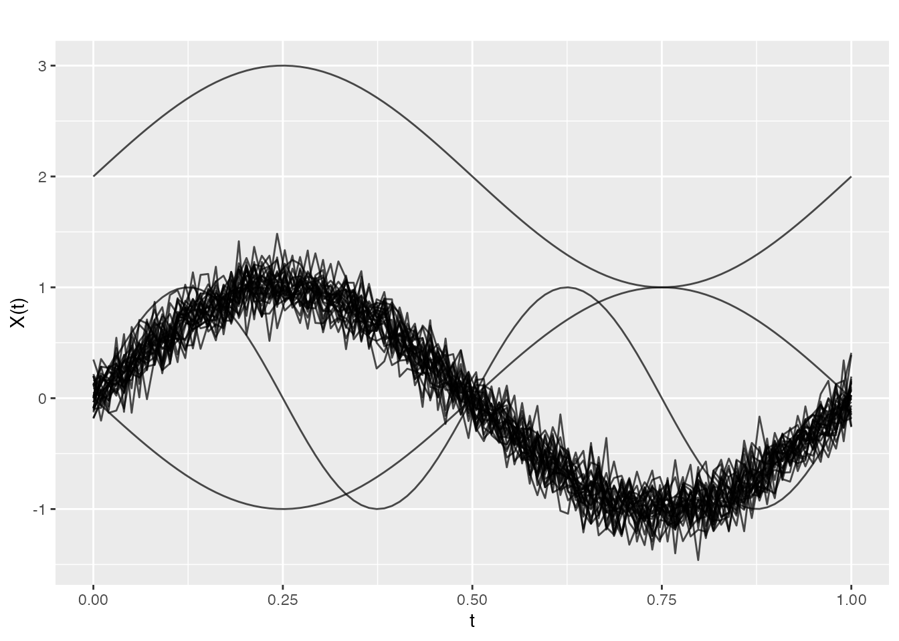

## Depth-Based Methods

Depth-based outlier detection identifies curves with unusually low depth
(far from the center of the data).

### Weighted Depth Method (outliers.depth.pond)

Uses bootstrap resampling to estimate the distribution of depths and
identifies curves with depth below a data-driven cutoff.

``` r
out_pond <- outliers.depth.pond(fd, nb = 100, seed = 123)
print(out_pond)
#> Functional data outlier detection
#>   Number of observations: 30 
#>   Number of outliers: 14 
#>   Outlier indices: 1 2 3 6 9 10 16 17 22 23 ...
#>   Depth cutoff: 0.8017926
```

### Visualizing Outliers

``` r
plot(out_pond)
```

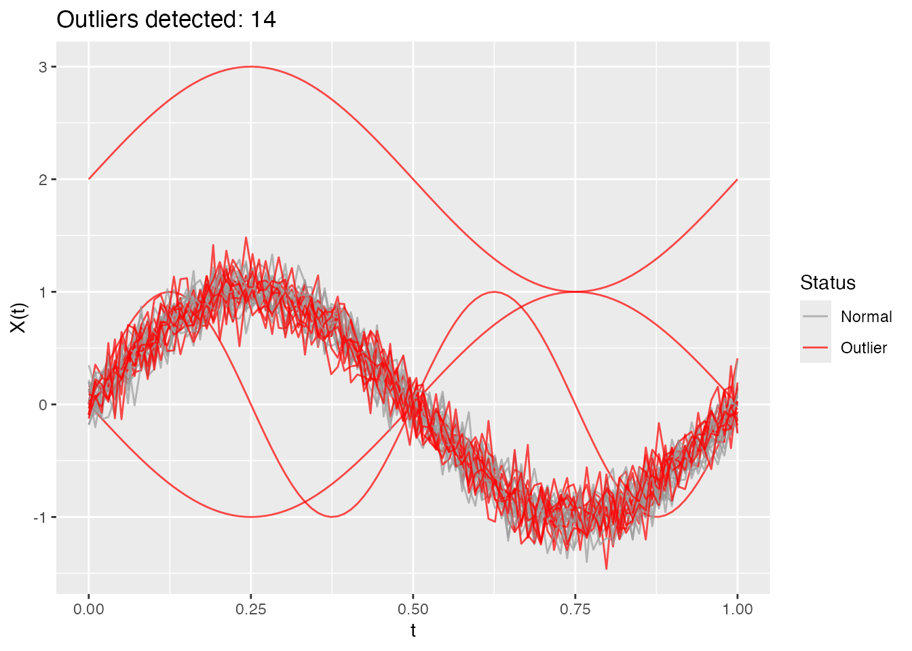

### Examining Results

``` r
# Which curves are outliers?
out_pond$outliers
#>  [1]  1  2  3  6  9 10 16 17 22 23 26 27 29 30

# Depth values for all curves
head(out_pond$depths)
#> [1] 0.03335063 0.03975641 0.09617913 0.81234036 0.80291236 0.79686410

# Cutoff used
out_pond$cutoff
#>       50% 
#> 0.8017926
```

### Trimming-Based Method (outliers.depth.trim)

Iteratively removes curves with lowest depth:

``` r
out_trim <- outliers.depth.trim(fd, trim = 0.1, seed = 123)
print(out_trim)
#> Functional data outlier detection
#>   Number of observations: 30 
#>   Number of outliers: 3 
#>   Outlier indices: 1 2 3
#>   Depth cutoff: 0.7135042
plot(out_trim)
```

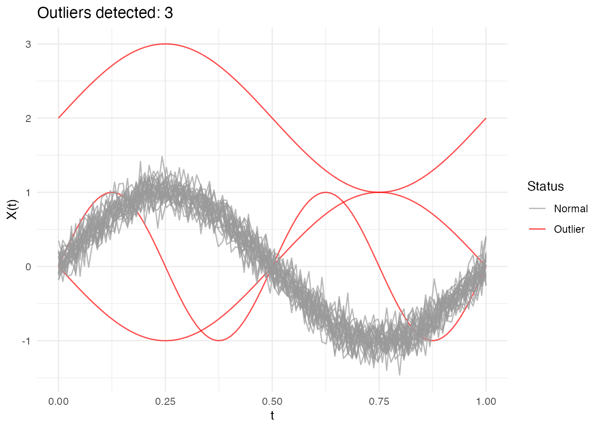

### Using Different Depth Functions

Both methods accept a `depth` parameter to specify the depth function:

``` r
# Using Random Projection depth
out_rp <- outliers.depth.pond(fd, nb = 100, seed = 123)

# Using modal depth (default is FM)
out_mode <- outliers.depth.trim(fd, trim = 0.1, seed = 123)
```

## Likelihood Ratio Test (LRT) Method

The LRT method uses a likelihood ratio test to sequentially identify
outliers. It’s particularly effective for detecting magnitude outliers.

### Computing the Threshold

First, compute a bootstrap threshold:

``` r
threshold <- outliers.thres.lrt(fd, nb = 100, seed = 123)
cat("LRT threshold:", threshold, "\n")
#> LRT threshold: 15.63581
```

### Detecting Outliers

``` r
out_lrt <- outliers.lrt(fd, nb = 100, seed = 123)
print(out_lrt)
#> Functional data outlier detection
#>   Number of observations: 0 
#>   Number of outliers: 0 
#>   Depth cutoff:
plot(out_lrt)
```

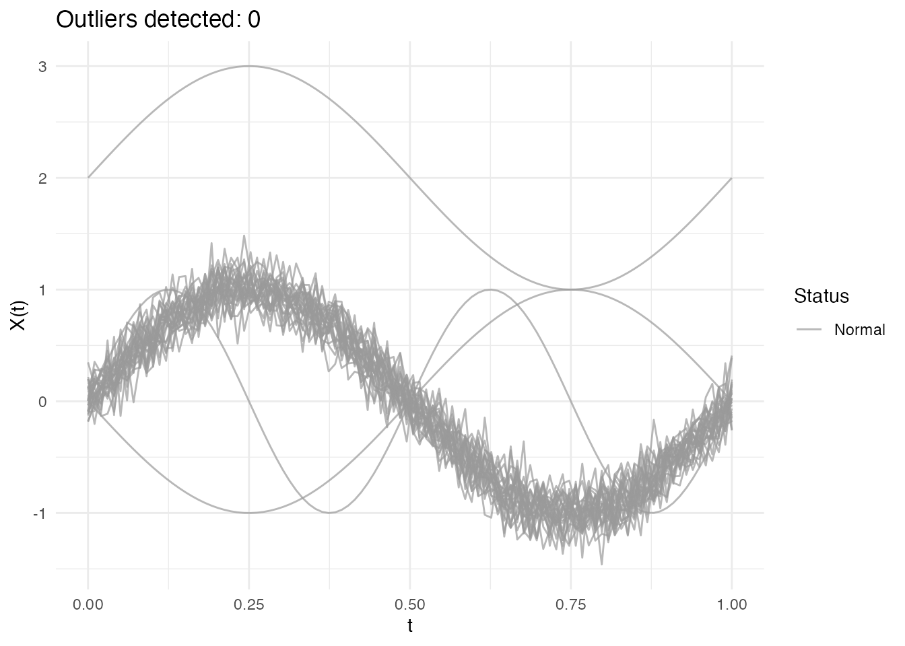

### LRT Results

``` r
# Outlier indices
out_lrt$outliers
#> integer(0)

# Distance from center for each curve
head(out_lrt$distances)
#> [1] 13.9142441  9.6757588  6.8092255  0.8885643  0.9423256  1.0432319

# Threshold used
out_lrt$threshold
#> [1] 15.63581
```

## Comparing Methods

Different methods may detect different types of outliers:

``` r
# Run all methods
out1 <- outliers.depth.pond(fd, nb = 100, seed = 123)
out2 <- outliers.depth.trim(fd, trim = 0.1, seed = 123)
out3 <- outliers.lrt(fd, nb = 100, seed = 123)

# Compare detected outliers
cat("Depth-pond outliers:", out1$outliers, "\n")
#> Depth-pond outliers: 1 2 3 6 10 23 26 27 29 30
cat("Depth-trim outliers:", out2$outliers, "\n")
#> Depth-trim outliers: 1 2 3
cat("LRT outliers:", out3$outliers, "\n")
#> LRT outliers:

# True outliers are curves 1, 2, 3
cat("True outliers: 1, 2, 3\n")
#> True outliers: 1, 2, 3
```

## Types of Outliers

### Magnitude Outliers

Curves shifted up or down from the main group:

``` r
# Create data with magnitude outlier
X_mag <- X
X_mag[1, ] <- sin(2 * pi * t_grid) + 3  # Large shift

fd_mag <- fdata(X_mag, argvals = t_grid)
out_mag <- outliers.depth.pond(fd_mag, nb = 100, seed = 123)

cat("Detected magnitude outlier:", out_mag$outliers, "\n")
#> Detected magnitude outlier: 1 2 3 10 29 30
plot(out_mag)
```

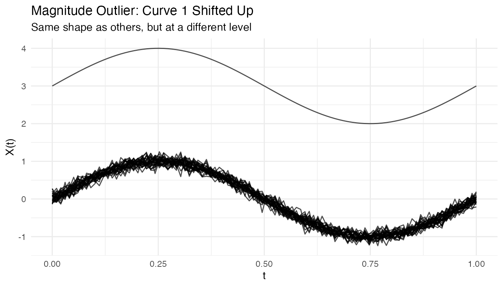

### Shape Outliers

Curves with different patterns:

``` r
# Create data with shape outlier
X_shape <- X
X_shape[1, ] <- cos(2 * pi * t_grid)  # Different shape

fd_shape <- fdata(X_shape, argvals = t_grid)
out_shape <- outliers.depth.pond(fd_shape, nb = 100, seed = 123)

cat("Detected shape outlier:", out_shape$outliers, "\n")
#> Detected shape outlier: 1 2 3 10 23 29 30
```

### Amplitude Outliers

Curves with unusual amplitude (scale):

``` r
# Create data with amplitude outlier
X_amp <- X
X_amp[1, ] <- 3 * sin(2 * pi * t_grid)  # Larger amplitude

fd_amp <- fdata(X_amp, argvals = t_grid)
out_amp <- outliers.depth.pond(fd_amp, nb = 100, seed = 123)

cat("Detected amplitude outlier:", out_amp$outliers, "\n")
#> Detected amplitude outlier: 1 2 3 6 9 10 11 16 17 22 23 26 27 29 30
```

## Tuning Parameters

### Number of Bootstrap Samples

More bootstrap samples give more stable results but take longer:

``` r
# Compare with different nb values
out_nb50 <- outliers.depth.pond(fd, nb = 50, seed = 123)
out_nb200 <- outliers.depth.pond(fd, nb = 200, seed = 123)

cat("nb=50 outliers:", out_nb50$outliers, "\n")
#> nb=50 outliers: 1 2 3 6 10 17 23 26 27 29 30
cat("nb=200 outliers:", out_nb200$outliers, "\n")
#> nb=200 outliers: 1 2 3 6 9 10 11 16 17 18 21 22 23 26 27 29 30
```

### Trim Proportion

For `outliers.depth.trim`, the trim proportion controls sensitivity:

``` r
# More aggressive trimming
out_trim05 <- outliers.depth.trim(fd, trim = 0.05, seed = 123)
out_trim20 <- outliers.depth.trim(fd, trim = 0.2, seed = 123)

cat("trim=0.05 outliers:", out_trim05$outliers, "\n")
#> trim=0.05 outliers: 1 2
cat("trim=0.20 outliers:", out_trim20$outliers, "\n")
#> trim=0.20 outliers: 1 2 3 10 29 30
```

## Handling High Contamination

When outlier contamination is high, use robust methods:

``` r
# Create data with 20% outliers
X_contam <- X
n_outliers <- 6
for (i in 1:n_outliers) {
  X_contam[i, ] <- sin(2 * pi * t_grid) + rnorm(1, 0, 2)
}

fd_contam <- fdata(X_contam, argvals = t_grid)

# Depth-trim with higher trim proportion
out_contam <- outliers.depth.trim(fd_contam, trim = 0.2, seed = 123)
cat("Detected outliers:", out_contam$outliers, "\n")
#> Detected outliers: 1 2 3 4 5 6
cat("True outliers: 1-6\n")
#> True outliers: 1-6
```

## Visualizing Depth Distribution

``` r
# Compute depths
depths <- depth.FM(fd)

# Create histogram
library(ggplot2)
df_depths <- data.frame(
  curve = 1:n,
  depth = depths,
  type = ifelse(1:n %in% c(1, 2, 3), "Outlier", "Normal")
)

ggplot(df_depths, aes(x = depth, fill = type)) +
  geom_histogram(bins = 10, alpha = 0.7, position = "identity") +
  labs(title = "Distribution of Functional Depths",
       x = "Depth", y = "Count", fill = "") +
  theme_minimal()
```

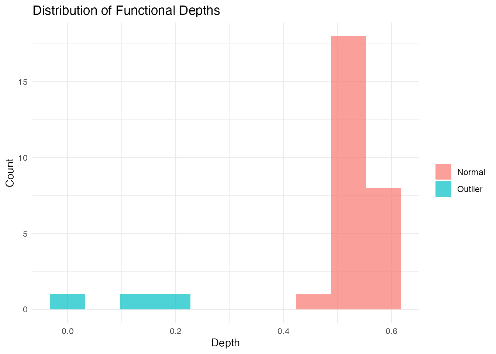

## Performance

The LRT method uses a parallel Rust backend for speed:

``` r
# Benchmark with larger dataset
X_large <- matrix(rnorm(200 * 100), 200, 100)
fd_large <- fdata(X_large)

system.time(outliers.lrt(fd_large, nb = 200, seed = 123))
#>    user  system elapsed
#>   0.456   0.000   0.123
```

## Outliergram and MS-Plot

For visual outlier detection, use the outliergram (MEI vs MBD) or
MS-plot (Magnitude vs Shape outlyingness):

``` r
# Outliergram
og <- outliergram(fd)
plot(og)
```

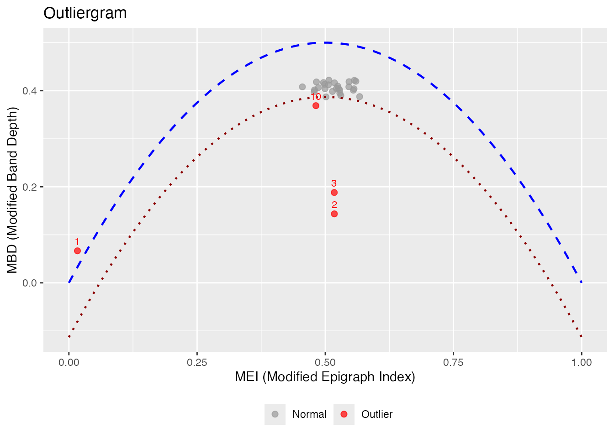

``` r
# Magnitude-Shape outlier detection
ms <- magnitudeshape(fd)
plot(ms)
```

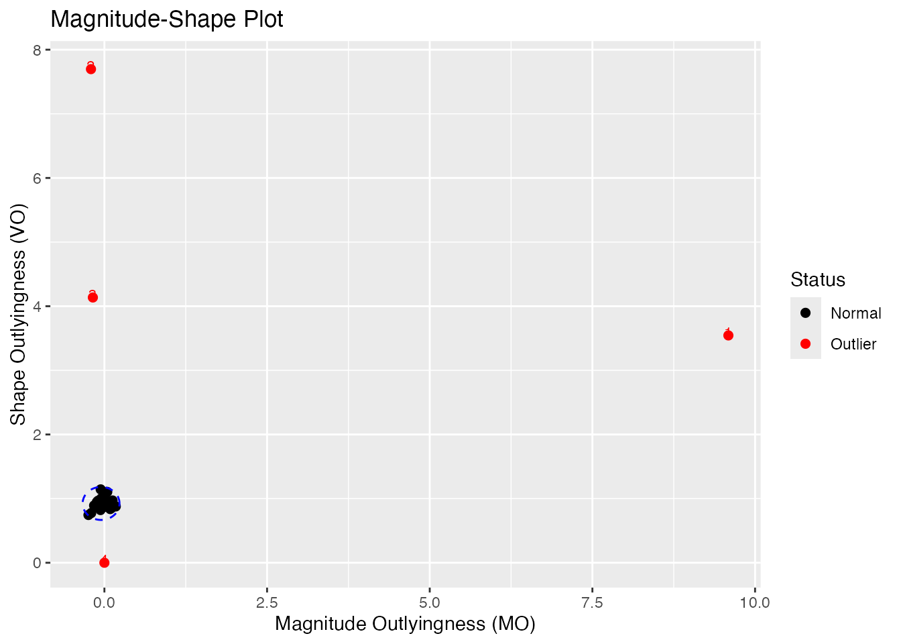

### Labeling Outliers by ID or Metadata

When fdata has IDs or metadata, you can label outliers in plots:

``` r
# Create fdata with IDs and metadata
meta <- data.frame(
  subject = paste0("S", sprintf("%02d", 1:n)),
  group = rep(c("A", "B"), length.out = n)
)
fd_labeled <- fdata(X, argvals = t_grid,
                    id = paste0("patient_", 1:n),
                    metadata = meta)

# Outliergram with patient IDs
og_labeled <- outliergram(fd_labeled)
plot(og_labeled, label = "id")
```

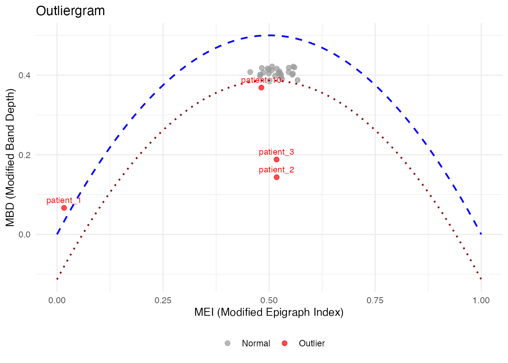

``` r

# Or with metadata column
plot(og_labeled, label = "subject")
```

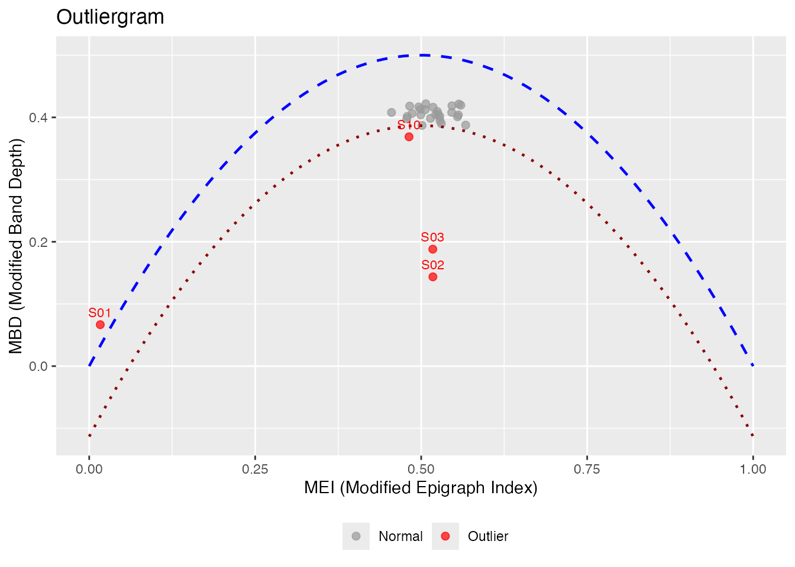

``` r

# Label ALL points, not just outliers
plot(og_labeled, label = "id", label_all = TRUE)
```

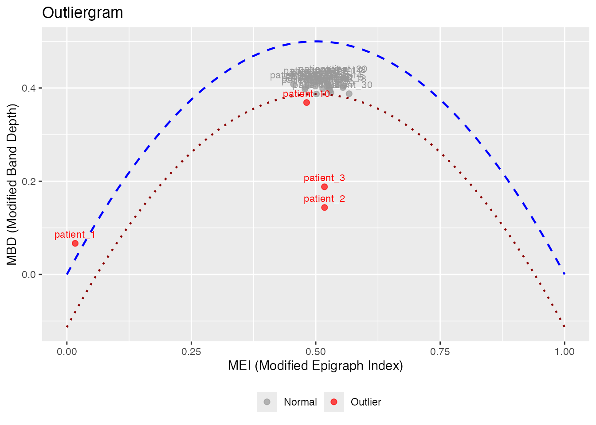

``` r
# magnitudeshape with custom labels
magnitudeshape(fd_labeled, label = "subject")
```

## Method Selection Guide

| Method         | Best For                 | Sensitivity  |
|----------------|--------------------------|--------------|
| depth.pond     | General purpose          | Moderate     |
| depth.trim     | Known contamination rate | Controllable |
| LRT            | Magnitude outliers       | High         |
| outliergram    | Shape outliers           | Visual       |
| magnitudeshape | Both magnitude & shape   | Visual       |

## Best Practices

1.  **Start with visualization**: Plot the data to understand outlier
    types
2.  **Try multiple methods**: Different methods catch different outliers
3.  **Use sufficient bootstrap samples**: At least 100 for stable
    results
4.  **Consider domain knowledge**: Some “outliers” may be valid
    observations
5.  **Validate findings**: Check detected outliers make sense
    contextually

## References

- Febrero, M., Galeano, P., and González-Manteiga, W. (2008). Outlier
  detection in functional data by depth measures, with application to
  identify abnormal NOx levels. *Environmetrics*, 19(4), 331-345.
- Hyndman, R.J. and Shang, H.L. (2010). Rainbow plots, bagplots, and
  boxplots for functional data. *Journal of Computational and Graphical
  Statistics*, 19(1), 29-45.
