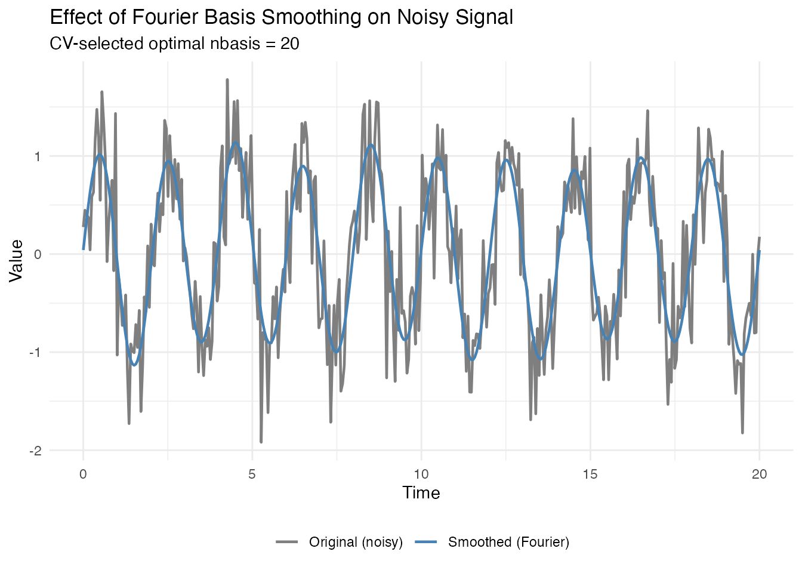
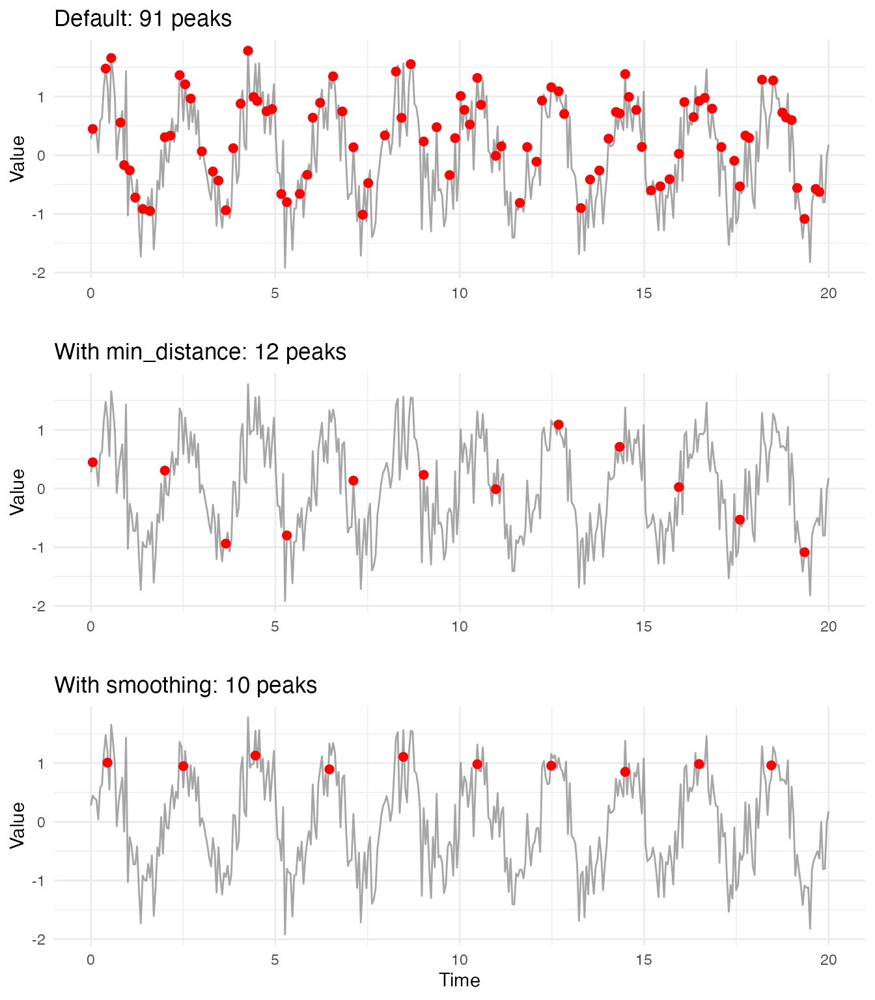
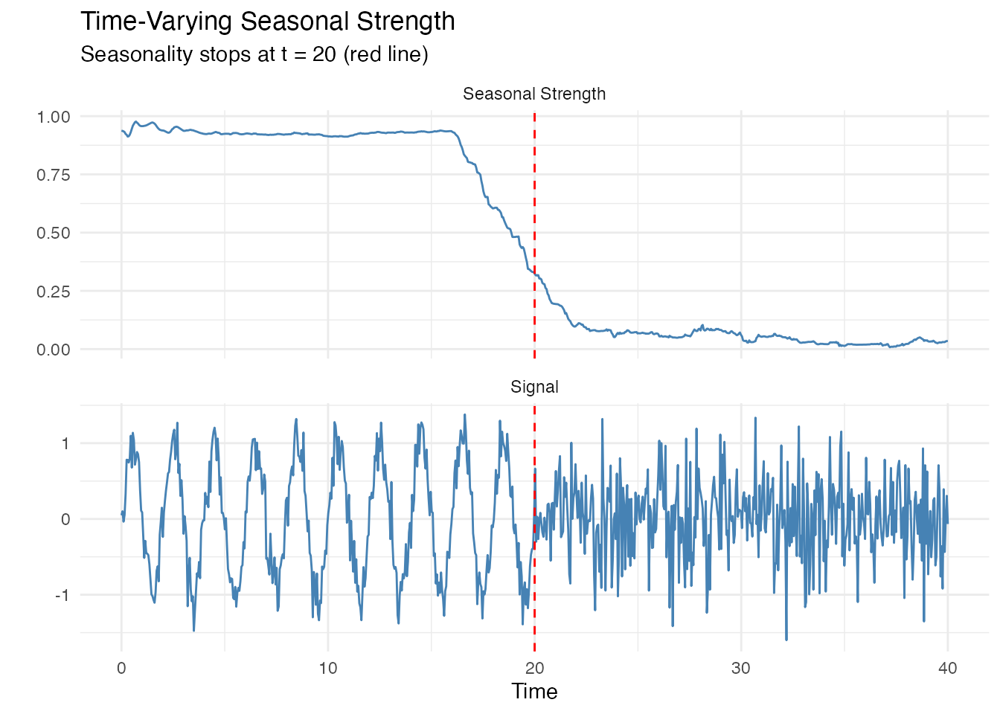
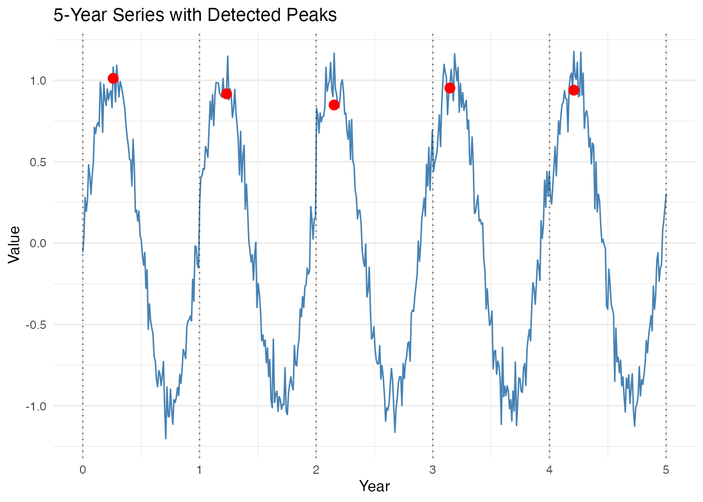
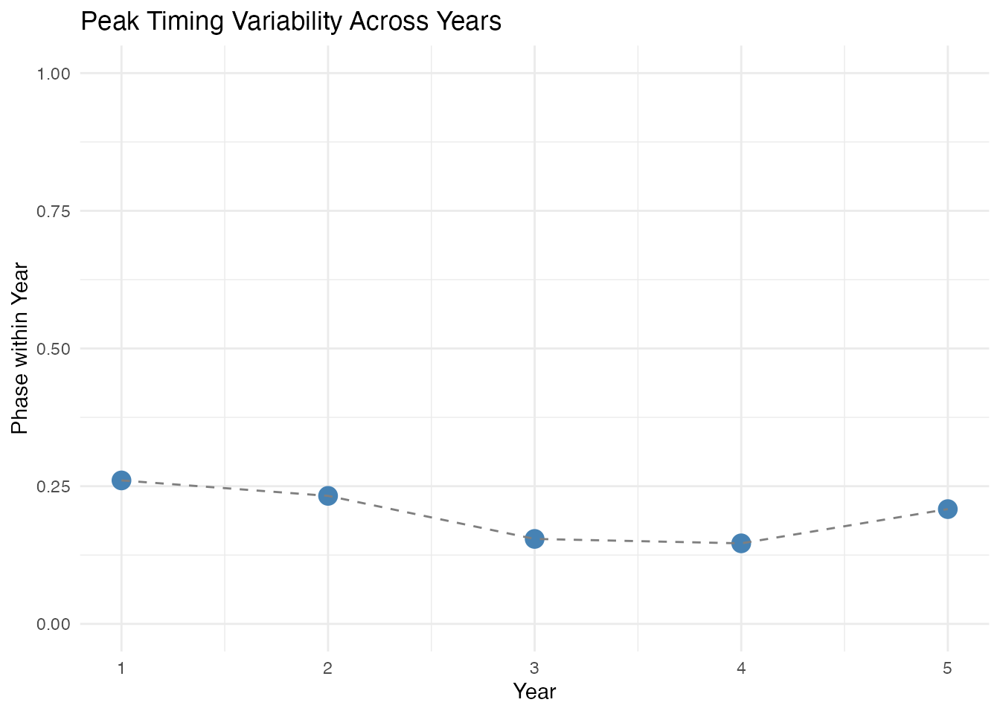
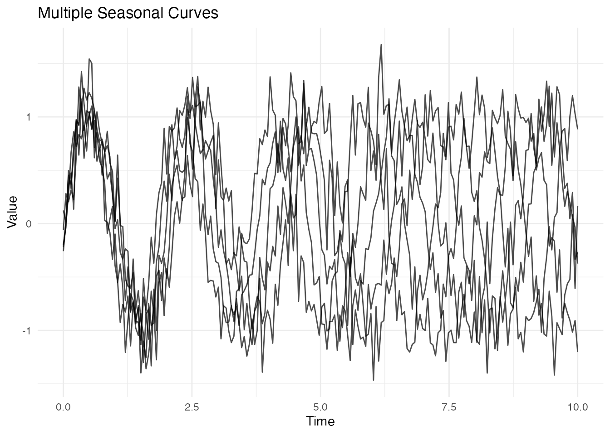

# Seasonal Analysis of Functional Data

## Introduction

Seasonal patterns are ubiquitous in functional data: temperature cycles,
biological rhythms, economic fluctuations, and many more. This vignette
demonstrates the seasonal analysis capabilities of fdars, organized from
basic period estimation to advanced techniques for complex signals.

**What you’ll learn:**

- How to estimate the period of seasonal signals
- How to detect multiple concurrent seasonalities
- How to tune peak detection parameters for noisy data
- When to use instantaneous period estimation (and when not to)
- How to analyze short series with only 3-5 cycles

``` r
library(fdars)
#> 
#> Attaching package: 'fdars'
#> The following objects are masked from 'package:stats':
#> 
#>     cov, deriv, median, sd, var
#> The following object is masked from 'package:base':
#> 
#>     norm
library(ggplot2)
theme_set(theme_minimal())
set.seed(42)
```

## Estimating Seasonal Period

The first step in seasonal analysis is often determining the period.
fdars provides two methods: FFT (frequency domain) and ACF
(autocorrelation).

### Simple Periodic Signals

Let’s start with a clean sinusoidal signal.

``` r
# Time grid: 10 complete cycles of period 2
t <- seq(0, 20, length.out = 400)
period_true <- 2

# Pure sine wave
X_pure <- sin(2 * pi * t / period_true)
fd_pure <- fdata(matrix(X_pure, nrow = 1), argvals = t)

# Plot
df <- data.frame(t = t, y = X_pure)
ggplot(df, aes(x = t, y = y)) +
  geom_line(color = "steelblue") +
  labs(title = "Pure Seasonal Signal (Period = 2)", x = "Time", y = "Value")
```


``` r
# FFT method
est_fft <- estimate_period(fd_pure, method = "fft")
cat("FFT estimate:", est_fft$period, "(true:", period_true, ")\n")
#> FFT estimate: 2.005013 (true: 2 )
cat("Confidence:", round(est_fft$confidence, 3), "\n")
#> Confidence: 199.585
```

The **confidence** value indicates how pronounced the dominant frequency
is relative to other frequencies. High confidence (close to 1) means a
clear, dominant period.

### Noisy Signals

Real data always contains noise. Let’s see how the methods handle it.

``` r
# Add noise
X_noisy <- sin(2 * pi * t / period_true) + rnorm(length(t), sd = 0.3)
fd_noisy <- fdata(matrix(X_noisy, nrow = 1), argvals = t)

df <- data.frame(t = t, y = X_noisy)
ggplot(df, aes(x = t, y = y)) +
  geom_line(color = "steelblue", alpha = 0.7) +
  labs(title = "Noisy Seasonal Signal (SD = 0.3)", x = "Time", y = "Value")
```


``` r
# Compare methods
est_fft_noisy <- estimate_period(fd_noisy, method = "fft")
est_acf <- estimate_period(fd_noisy, method = "acf")

cat("True period:", period_true, "\n")
#> True period: 2
cat("FFT estimate:", est_fft_noisy$period, "(confidence:", round(est_fft_noisy$confidence, 3), ")\n")
#> FFT estimate: 2.005013 (confidence: 171.93 )
cat("ACF estimate:", est_acf$period, "(confidence:", round(est_acf$confidence, 3), ")\n")
#> ACF estimate: 2.005013 (confidence: 0.783 )
```

Both methods typically agree for clean periodic signals. The ACF method
can be more robust to certain types of noise, while FFT is faster and
handles multiple harmonics well.

### Signals with Multiple Harmonics

Real seasonal patterns often have harmonics (e.g., yearly + half-yearly
components that share the same fundamental period).

``` r
# Signal with 2nd and 3rd harmonics
X_multi <- sin(2 * pi * t / period_true) +
           0.3 * sin(4 * pi * t / period_true) +  # 2nd harmonic
           0.1 * sin(6 * pi * t / period_true) +  # 3rd harmonic
           rnorm(length(t), sd = 0.1)
fd_multi <- fdata(matrix(X_multi, nrow = 1), argvals = t)

df <- data.frame(t = t, y = X_multi)
ggplot(df, aes(x = t, y = y)) +
  geom_line(color = "steelblue") +
  labs(title = "Signal with Multiple Harmonics", x = "Time", y = "Value")
```


``` r
est_multi <- estimate_period(fd_multi, method = "fft")
cat("Estimated period:", est_multi$period, "(true:", period_true, ")\n")
#> Estimated period: 2.005013 (true: 2 )
```

The FFT method correctly identifies the **fundamental period**, even
when harmonics are present. The harmonics share the same fundamental
frequency, so they reinforce the estimate.

## Detecting Multiple Concurrent Seasonalities

Sometimes a signal contains **multiple independent periodicities**
(e.g., daily and yearly cycles). The
[`estimate_period()`](https://sipemu.github.io/fdars/reference/estimate_period.md)
function returns only the dominant period. Here’s how to detect multiple
periods.

### Why estimate_period() Returns Only One Period

``` r
# Signal with two independent periods
period1 <- 2   # Fast cycle
period2 <- 7   # Slow cycle

X_dual <- sin(2 * pi * t / period1) + 0.6 * sin(2 * pi * t / period2)
fd_dual <- fdata(matrix(X_dual, nrow = 1), argvals = t)

df <- data.frame(t = t, y = X_dual)
ggplot(df, aes(x = t, y = y)) +
  geom_line(color = "steelblue") +
  labs(title = "Signal with Two Periods (2 and 7)",
       x = "Time", y = "Value")
```


``` r
est_single <- estimate_period(fd_dual, method = "fft")
cat("Single estimate:", est_single$period, "\n")
#> Single estimate: 2.005013
cat("(Only detects the dominant period)\n")
#> (Only detects the dominant period)
```

### Using detect_multiple_periods()

The
[`detect_multiple_periods()`](https://sipemu.github.io/fdars/reference/detect_multiple_periods.md)
function uses an iterative residual approach implemented in Rust for
efficiency:

1.  Estimate the dominant period using FFT
2.  Subtract a fitted sinusoid at that period
3.  Repeat on the residual until confidence or strength drops too low

``` r
# Detect multiple periods using the package function
# Higher thresholds prevent spurious detection
detected <- detect_multiple_periods(fd_dual, max_periods = 3,
                                     min_confidence = 0.5,
                                     min_strength = 0.25)
print(detected)
#> Multiple Period Detection
#> -------------------------
#> Periods detected: 3
#> 
#> Period 1: 2.005 (confidence=146.769, strength=0.734, amplitude=1.013)
#> Period 2: 6.683 (confidence=188.230, strength=0.949, amplitude=0.592)
#> Period 3: 10.025 (confidence=60.453, strength=0.650, amplitude=0.081)
```

### Visualizing the Decomposition

``` r
# Reconstruct each component using detected periods
components <- data.frame(t = t)
residual <- X_dual

if (detected$n_periods > 0) {
  for (i in seq_len(detected$n_periods)) {
    omega <- 2 * pi / detected$periods[i]
    cos_comp <- cos(omega * t)
    sin_comp <- sin(omega * t)
    a <- 2 * mean(residual * cos_comp)
    b <- 2 * mean(residual * sin_comp)
    component <- a * cos_comp + b * sin_comp
    components[[paste0("Period_", round(detected$periods[i], 1))]] <- component
    residual <- residual - component
  }
}
components$Residual <- residual
components$Original <- X_dual

# Plot decomposition
library(tidyr)
df_long <- pivot_longer(components, -t, names_to = "Component", values_to = "Value")
# Get period column names (exclude t, Residual, Original)
period_cols <- setdiff(names(components), c("t", "Residual", "Original"))
df_long$Component <- factor(df_long$Component,
                            levels = c("Original", period_cols, "Residual"))

ggplot(df_long, aes(x = t, y = Value)) +
  geom_line(color = "steelblue") +
  facet_wrap(~Component, ncol = 1, scales = "free_y") +
  labs(title = "Decomposition into Periodic Components",
       x = "Time", y = "Value")
```


**Practical guidance:**

- For **harmonics of the same fundamental**:
  [`estimate_period()`](https://sipemu.github.io/fdars/reference/estimate_period.md)
  correctly finds the fundamental period. No iterative approach needed.
- For **truly different periods** (e.g., daily + yearly): use the
  iterative approach above.
- When **confidence drops below threshold**: stop - remaining signal is
  likely noise.

**Note on detection order:** Periods are detected in order of
**amplitude**, not period length. The component with the highest FFT
power (roughly proportional to amplitude squared) is found first. For
example, if a signal has a weak yearly cycle and a strong weekly cycle,
the weekly cycle will be detected first regardless of which period is
longer. Very weak periodicities (\< 20% of the dominant amplitude) may
require lower thresholds but risk false positives.

## Peak Detection

Peak detection identifies local maxima in seasonal signals. This is
useful for characterizing seasonal patterns and estimating period from
peak-to-peak distances.

### Parameter Tuning Guide

Peak detection quality depends heavily on parameters. Here’s a
reference:

| Parameter        | Purpose                    | Typical Values       | When to Adjust                   |
|------------------|----------------------------|----------------------|----------------------------------|
| `min_distance`   | Minimum time between peaks | `period * 0.8`       | Set to ~80% of expected period   |
| `min_prominence` | How much peak stands out   | 0.1-0.5 x amplitude  | Increase if too many noise peaks |
| `smooth_first`   | Pre-smooth noisy data      | `TRUE` for real data | Almost always use `TRUE`         |
| `smooth_nbasis`  | Number of Fourier basis    | `NULL` (auto CV)     | Let CV choose optimal nbasis     |

### Effect of Parameters

Let’s demonstrate how parameters affect detection quality.

``` r
# Moderately noisy signal
X_demo <- sin(2 * pi * t / period_true) + rnorm(length(t), sd = 0.4)
fd_demo <- fdata(matrix(X_demo, nrow = 1), argvals = t)

df <- data.frame(t = t, y = X_demo)
```

### Visualizing the Smoothing Step

Before detecting peaks, let’s see what Fourier basis smoothing does to
noisy data:

``` r
# Apply Fourier basis smoothing with CV-selected optimal nbasis
cv_result <- fdata2basis.cv(fd_demo, nbasis.range = 5:25, type = "fourier", criterion = "GCV")
fd_smoothed <- cv_result$fitted

# Compare original vs smoothed
df_smooth <- data.frame(
  t = rep(t, 2),
  y = c(X_demo, fd_smoothed$data[1, ]),
  type = rep(c("Original (noisy)", "Smoothed (Fourier)"), each = length(t))
)

ggplot(df_smooth, aes(x = t, y = y, color = type)) +
  geom_line(linewidth = 0.8) +
  scale_color_manual(values = c("Original (noisy)" = "gray50",
                                 "Smoothed (Fourier)" = "steelblue")) +
  labs(title = "Effect of Fourier Basis Smoothing on Noisy Signal",
       subtitle = paste("CV-selected optimal nbasis =", cv_result$optimal.nbasis),
       x = "Time", y = "Value", color = NULL) +
  theme(legend.position = "bottom")
```



Fourier basis smoothing is ideal for seasonal signals because it
naturally captures periodic patterns. Peak detection on the smoothed
data will find the true peaks, not noise spikes.

``` r
# Default parameters - often too many peaks
peaks_default <- detect_peaks(fd_demo)
cat("Default parameters:", nrow(peaks_default$peaks[[1]]), "peaks found\n")
#> Default parameters: 91 peaks found
cat("(Expected:", floor(max(t) / period_true), "peaks)\n")
#> (Expected: 10 peaks)
```

``` r
# Add minimum distance constraint
peaks_distance <- detect_peaks(fd_demo, min_distance = period_true * 0.8)
cat("With min_distance:", nrow(peaks_distance$peaks[[1]]), "peaks found\n")
#> With min_distance: 12 peaks found
```

``` r
# Add smoothing for best results
peaks_smooth <- detect_peaks(fd_demo, min_distance = period_true * 0.8,
                             smooth_first = TRUE, smooth_lambda = NULL)
cat("With smoothing:", nrow(peaks_smooth$peaks[[1]]), "peaks found\n")
#> With smoothing: 6 peaks found
cat("Estimated period from peaks:", round(peaks_smooth$mean_period, 3), "\n")
#> Estimated period from peaks: 3.649
```

### Visualizing the Difference

``` r
# Prepare data for plotting
df_default <- peaks_default$peaks[[1]]
df_distance <- peaks_distance$peaks[[1]]
df_smooth <- peaks_smooth$peaks[[1]]

# Create combined plot
p1 <- ggplot(df, aes(x = t, y = y)) +
  geom_line(color = "gray50", alpha = 0.7) +
  geom_point(data = df_default, aes(x = time, y = value),
             color = "red", size = 2) +
  labs(title = paste("Default:", nrow(df_default), "peaks"),
       x = "", y = "Value")

p2 <- ggplot(df, aes(x = t, y = y)) +
  geom_line(color = "gray50", alpha = 0.7) +
  geom_point(data = df_distance, aes(x = time, y = value),
             color = "red", size = 2) +
  labs(title = paste("With min_distance:", nrow(df_distance), "peaks"),
       x = "", y = "Value")

p3 <- ggplot(df, aes(x = t, y = y)) +
  geom_line(color = "gray50", alpha = 0.7) +
  geom_point(data = df_smooth, aes(x = time, y = value),
             color = "red", size = 2) +
  labs(title = paste("With smoothing:", nrow(df_smooth), "peaks"),
       x = "Time", y = "Value")

library(gridExtra)
grid.arrange(p1, p2, p3, ncol = 1)
```



**Key insight:** For seasonal data, use Fourier basis smoothing with
[`fdata2basis.cv()`](https://sipemu.github.io/fdars/reference/fdata2basis.cv.md)
to let CV automatically select the optimal number of basis functions.

### Prominence Filtering

Prominence measures how much a peak stands out from surrounding values.
Use it to filter minor peaks.

``` r
# Compare prominence thresholds
peaks_low_prom <- detect_peaks(fd_demo, min_distance = 1.5, min_prominence = 0.1)
peaks_high_prom <- detect_peaks(fd_demo, min_distance = 1.5, min_prominence = 0.5)

cat("Low prominence (0.1):", nrow(peaks_low_prom$peaks[[1]]), "peaks\n")
#> Low prominence (0.1): 4 peaks
cat("High prominence (0.5):", nrow(peaks_high_prom$peaks[[1]]), "peaks\n")
#> High prominence (0.5): 1 peaks
```

## Measuring Seasonal Strength

Seasonal strength quantifies how much of the signal’s variance is
explained by the seasonal component. Values range from 0 (no
seasonality) to 1 (pure seasonal signal).

### Variance vs Spectral Methods

``` r
ss_variance <- seasonal_strength(fd_noisy, period = period_true, method = "variance")
ss_spectral <- seasonal_strength(fd_noisy, period = period_true, method = "spectral")

cat("Variance method:", round(ss_variance, 3), "\n")
#> Variance method: 0.863
cat("Spectral method:", round(ss_spectral, 3), "\n")
#> Spectral method: 0.893
```

### Comparing Different Signal Types

``` r
# Create signals with different seasonality levels
X_noise <- rnorm(length(t))  # Pure noise
fd_noise <- fdata(matrix(X_noise, nrow = 1), argvals = t)

X_mixed <- 0.5 * sin(2 * pi * t / period_true) + 0.5 * rnorm(length(t))
fd_mixed <- fdata(matrix(X_mixed, nrow = 1), argvals = t)

# Calculate strengths
strengths <- c(
  "Pure seasonal" = seasonal_strength(fd_pure, period = period_true),
  "Noisy seasonal (0.3 SD)" = seasonal_strength(fd_noisy, period = period_true),
  "Mixed (50/50)" = seasonal_strength(fd_mixed, period = period_true),
  "Pure noise" = seasonal_strength(fd_noise, period = period_true)
)

df_strength <- data.frame(
  Signal = factor(names(strengths), levels = names(strengths)),
  Strength = strengths
)

ggplot(df_strength, aes(x = Signal, y = Strength, fill = Signal)) +
  geom_col() +
  labs(title = "Seasonal Strength Comparison",
       x = "", y = "Seasonal Strength") +
  ylim(0, 1) +
  theme(legend.position = "none",
        axis.text.x = element_text(angle = 15, hjust = 1))
```


### Time-Varying Seasonal Strength

Seasonal strength can change over time. Use a sliding window to track
this.

``` r
# Signal that loses seasonality
t_long <- seq(0, 40, length.out = 800)
X_changing <- ifelse(t_long < 20,
                     sin(2 * pi * t_long / period_true) + rnorm(sum(t_long < 20), sd = 0.2),
                     rnorm(sum(t_long >= 20), sd = 0.5))
fd_changing <- fdata(matrix(X_changing, nrow = 1), argvals = t_long)

# Compute time-varying strength
ss_curve <- seasonal_strength_curve(fd_changing, period = period_true,
                                     window_size = 4 * period_true)

# Plot both signal and strength
df1 <- data.frame(t = t_long, y = X_changing, panel = "Signal")
df2 <- data.frame(t = t_long, y = ss_curve$data[1,], panel = "Seasonal Strength")
df_combined <- rbind(df1, df2)

ggplot(df_combined, aes(x = t, y = y)) +
  geom_line(color = "steelblue") +
  facet_wrap(~panel, ncol = 1, scales = "free_y") +
  geom_vline(xintercept = 20, linetype = "dashed", color = "red") +
  labs(title = "Time-Varying Seasonal Strength",
       subtitle = "Seasonality stops at t = 20 (red line)",
       x = "Time", y = "")
```



## Change Detection

Automatically detect when seasonality starts or stops.

### Manual Threshold

``` r
changes <- detect_seasonality_changes(fd_changing, period = period_true,
                                       threshold = 0.3,
                                       window_size = 4 * period_true,
                                       min_duration = 2 * period_true)
print(changes)
#> Seasonality Change Detection
#> ----------------------------
#> Number of changes: 1
#> 
#>       time      type strength_before strength_after
#> 1 20.32541 cessation       0.3027155      0.2990393
```

### Automatic Threshold (Otsu’s Method)

When you don’t know the appropriate threshold, use Otsu’s method to
determine it automatically from the data.

``` r
changes_auto <- detect_seasonality_changes_auto(fd_changing, period = period_true,
                                                 threshold_method = "otsu")
print(changes_auto)
#> Seasonality Change Detection (Auto Threshold)
#> ----------------------------------------------
#> Computed threshold: 0.4878
#> Number of changes: 1
#> 
#>       time      type strength_before strength_after
#> 1 19.52441 cessation       0.5462295      0.4869599
```

### Visualizing Change Points

``` r
df <- data.frame(t = t_long, y = X_changing)

p <- ggplot(df, aes(x = t, y = y)) +
  geom_line(color = "steelblue", alpha = 0.7) +
  labs(title = "Seasonality Change Detection",
       x = "Time", y = "Value")

# Add change points
if (nrow(changes_auto$change_points) > 0) {
  for (i in 1:nrow(changes_auto$change_points)) {
    cp <- changes_auto$change_points[i, ]
    p <- p + geom_vline(xintercept = cp$time,
                        linetype = "dashed",
                        color = ifelse(cp$type == "onset", "green4", "red"),
                        linewidth = 1)
  }
  p <- p + labs(subtitle = "Green = onset, Red = cessation")
}
print(p)
```


## Signals with Varying Period

Some signals have periods that drift or change over time. The
[`instantaneous_period()`](https://sipemu.github.io/fdars/reference/instantaneous_period.md)
function uses the Hilbert transform to estimate the period at each time
point.

### When to Use Instantaneous Period

**Good use cases:**

- Slowly drifting systems (circadian rhythms shifting with seasons)
- Frequency-modulated (FM) signals in engineering
- Climate oscillations with variable period (e.g., ENSO)

**Poor use cases:**

- Random frequency jumps (use change detection instead)
- Multiple concurrent periodicities (use iterative approach instead)
- Very noisy short series (use peak-to-peak methods instead)

### Chirp Signal (Smoothly Increasing Frequency)

``` r
# Chirp: frequency increases linearly
t_chirp <- seq(0, 10, length.out = 500)
freq <- 0.5 + 0.15 * t_chirp  # Frequency increases from 0.5 to 2
phase <- 2 * pi * cumsum(freq) * diff(c(0, t_chirp))
X_chirp <- sin(phase)
fd_chirp <- fdata(matrix(X_chirp, nrow = 1), argvals = t_chirp)

df <- data.frame(t = t_chirp, y = X_chirp)
ggplot(df, aes(x = t, y = y)) +
  geom_line(color = "steelblue") +
  labs(title = "Chirp Signal (Smoothly Increasing Frequency)",
       x = "Time", y = "Value")
```


``` r
inst <- instantaneous_period(fd_chirp)

# True period (1/frequency)
true_period <- 1 / freq

# Compare
df <- data.frame(
  t = t_chirp,
  Estimated = inst$period$data[1,],
  True = true_period
)

# Remove extreme values at boundaries
df$Estimated[df$Estimated > 5 | df$Estimated < 0] <- NA

ggplot(df, aes(x = t)) +
  geom_line(aes(y = True, color = "True"), linewidth = 1) +
  geom_line(aes(y = Estimated, color = "Estimated"), alpha = 0.7) +
  scale_color_manual(values = c("True" = "steelblue", "Estimated" = "coral")) +
  labs(title = "Instantaneous Period Estimation",
       x = "Time", y = "Period", color = "") +
  ylim(0, 3)
```


### Amplitude Envelope Extraction

The Hilbert transform also provides the instantaneous amplitude
(envelope), useful for amplitude-modulated signals.

``` r
# Amplitude-modulated signal
envelope_true <- 1 + 0.5 * sin(2 * pi * t / 10)  # Slow modulation
X_am <- envelope_true * sin(2 * pi * t / period_true)
fd_am <- fdata(matrix(X_am, nrow = 1), argvals = t)

inst_am <- instantaneous_period(fd_am)

df <- data.frame(
  t = t,
  Signal = X_am,
  Envelope = inst_am$amplitude$data[1,]
)

ggplot(df, aes(x = t)) +
  geom_line(aes(y = Signal), color = "steelblue", alpha = 0.7) +
  geom_line(aes(y = Envelope), color = "red", linewidth = 1) +
  geom_line(aes(y = -Envelope), color = "red", linewidth = 1) +
  labs(title = "Amplitude Envelope Extraction",
       subtitle = "Red lines show the extracted envelope",
       x = "Time", y = "Value")
```


### Limitations and Alternatives

**Boundary effects:** The Hilbert transform produces unreliable
estimates near the beginning and end of the series.

**Noise sensitivity:** High-frequency noise can corrupt period
estimates. Consider smoothing first.

**Random frequency changes:** When frequency changes abruptly and
randomly, the instantaneous period estimate becomes unreliable.

``` r
# Demonstrate limitation: signal with random frequency regime changes
set.seed(123)
t_rand <- seq(0, 20, length.out = 400)
freq_regime <- rep(c(1, 2, 0.5, 1.5), each = 100)  # Abrupt changes
X_rand <- sin(2 * pi * cumsum(freq_regime) * diff(c(0, t_rand)))
fd_rand <- fdata(matrix(X_rand, nrow = 1), argvals = t_rand)

inst_rand <- instantaneous_period(fd_rand)
est_period <- inst_rand$period$data[1,]
est_period[est_period > 5 | est_period < 0.1] <- NA

df <- data.frame(
  t = t_rand,
  True = 1/freq_regime,
  Estimated = est_period
)

ggplot(df, aes(x = t)) +
  geom_step(aes(y = True, color = "True"), linewidth = 1) +
  geom_line(aes(y = Estimated, color = "Estimated"), alpha = 0.7) +
  scale_color_manual(values = c("True" = "steelblue", "Estimated" = "coral")) +
  labs(title = "Limitation: Abrupt Frequency Changes",
       subtitle = "Hilbert transform struggles with discontinuities",
       x = "Time", y = "Period", color = "")
```


**Alternative for abrupt changes:** Use
[`detect_seasonality_changes()`](https://sipemu.github.io/fdars/reference/detect_seasonality_changes.md)
to find regime boundaries, then analyze each segment separately.

## Working with Short Series

For short series with only 3-5 complete cycles, fdars provides
specialized functions for analyzing peak timing variability and
classifying seasonality.

### Challenges with Few Cycles

- Period estimation has limited frequency resolution
- Statistical measures have high uncertainty
- Peak-to-peak analysis becomes more important

### Peak Timing Variability

Detect shifts in peak timing between cycles (e.g., a phenological event
shifting from March to April to May over several years).

``` r
# Simulate 5 years where peak timing shifts
t_short <- seq(0, 5, length.out = 500)
period_short <- 1

# Peaks shift gradually later each year
phase_shifts <- c(0, 0.05, 0.10, 0.08, 0.04)
X_short <- rep(0, length(t_short))
for (i in 1:length(t_short)) {
  year <- floor(t_short[i]) + 1
  year <- min(year, 5)
  X_short[i] <- sin(2 * pi * (t_short[i] + phase_shifts[year]) / period_short)
}
X_short <- X_short + rnorm(length(t_short), sd = 0.1)

fd_short <- fdata(matrix(X_short, nrow = 1), argvals = t_short)
```

``` r
# Plot the short series
df_short <- data.frame(t = t_short, y = X_short)
ggplot(df_short, aes(x = t, y = y)) +
  geom_line(color = "steelblue") +
  geom_vline(xintercept = 0:5, linetype = "dotted", alpha = 0.5) +
  labs(title = "5-Year Series with Variable Peak Timing",
       x = "Year", y = "Value")
```


``` r
# Analyze peak timing
timing <- analyze_peak_timing(fd_short, period = period_short)
print(timing)
#> Peak Timing Variability Analysis
#> ---------------------------------
#> Number of peaks: 5
#> Mean timing:     0.2004
#> Std timing:      0.0442
#> Range timing:    0.1142
#> Variability:     0.4418 (moderate)
#> Timing trend:    -0.0190
```

### Visualizing Peak Timing

``` r
# Get detected peaks
peaks_short <- detect_peaks(fd_short, min_distance = 0.7,
                            smooth_first = TRUE, smooth_lambda = NULL)
peak_df <- peaks_short$peaks[[1]]

# Plot with peaks marked
ggplot(df_short, aes(x = t, y = y)) +
  geom_line(color = "steelblue") +
  geom_point(data = peak_df, aes(x = time, y = value),
             color = "red", size = 3) +
  geom_vline(xintercept = 0:5, linetype = "dotted", alpha = 0.5) +
  labs(title = "5-Year Series with Detected Peaks",
       x = "Year", y = "Value")
```



``` r
# Plot peak timing within each year
if (nrow(peak_df) >= 3) {
  peak_years <- floor(peak_df$time)
  peak_phase <- peak_df$time - peak_years

  df_timing <- data.frame(
    year = peak_years + 1,
    phase = peak_phase
  )

  ggplot(df_timing, aes(x = year, y = phase)) +
    geom_point(size = 4, color = "steelblue") +
    geom_line(linetype = "dashed", color = "gray50") +
    labs(title = "Peak Timing Variability Across Years",
         x = "Year", y = "Phase within Year") +
    ylim(0, 1)
}
```



### Seasonality Classification

Automatically classify the type of seasonality pattern.

``` r
class_result <- classify_seasonality(fd_short, period = period_short)
print(class_result)
#> Seasonality Classification
#> --------------------------
#> Classification:   StableSeasonal
#> Is seasonal:      TRUE
#> Stable timing:    TRUE
#> Timing variability: 0.4418
#> Seasonal strength:  0.9351
```

``` r
# Visualize classification metrics
# Normalize timing variability to 0-1 scale (lower is better/more stable)
stability_score <- 1 - min(1, class_result$timing_variability / 0.2)

class_df <- data.frame(
  Metric = c("Seasonal Strength", "Timing Stability"),
  Value = c(class_result$seasonal_strength, stability_score)
)

ggplot(class_df, aes(x = Metric, y = Value, fill = Metric)) +
  geom_col() +
  ylim(0, 1) +
  labs(title = paste("Classification:", class_result$classification),
       x = "", y = "Score") +
  scale_fill_brewer(palette = "Set2") +
  theme(legend.position = "none")
```


### Classification Types

The
[`classify_seasonality()`](https://sipemu.github.io/fdars/reference/classify_seasonality.md)
function returns one of four classifications based on seasonal strength
and timing variability:

| Classification   | Seasonal Strength | Timing Variability | Interpretation                          |
|------------------|-------------------|--------------------|-----------------------------------------|
| **stable**       | \> 0.7            | \< 0.05            | Consistent pattern across cycles        |
| **variable**     | 0.4 - 0.7         | 0.05 - 0.15        | Clear seasonality but parameters change |
| **intermittent** | \< 0.4            | any                | Seasonality appears and disappears      |
| **none**         | \< 0.2            | any                | No clear seasonal pattern               |

``` r
# Example: Stable seasonality - clean signal with consistent timing
X_stable <- sin(2 * pi * t_short / period_short) + rnorm(length(t_short), sd = 0.05)
fd_stable <- fdata(matrix(X_stable, nrow = 1), argvals = t_short)
class_stable <- classify_seasonality(fd_stable, period = period_short)

# Example: Variable seasonality - amplitude and timing drift
phase_var <- seq(0, 0.2, length.out = length(t_short))
amp_var <- 1 + 0.3 * sin(2 * pi * t_short / 3)
X_variable <- amp_var * sin(2 * pi * (t_short + phase_var) / period_short) +
              rnorm(length(t_short), sd = 0.2)
fd_variable <- fdata(matrix(X_variable, nrow = 1), argvals = t_short)
class_variable <- classify_seasonality(fd_variable, period = period_short)

# Example: Intermittent seasonality - pattern appears and disappears
X_intermittent <- ifelse(t_short < 2 | t_short > 4,
                         sin(2 * pi * t_short / period_short),
                         rnorm(sum(t_short >= 2 & t_short <= 4), sd = 0.5))
X_intermittent <- X_intermittent + rnorm(length(t_short), sd = 0.15)
fd_intermittent <- fdata(matrix(X_intermittent, nrow = 1), argvals = t_short)
class_intermittent <- classify_seasonality(fd_intermittent, period = period_short)

# Example: No seasonality - pure noise
X_none <- rnorm(length(t_short), sd = 1)
fd_none <- fdata(matrix(X_none, nrow = 1), argvals = t_short)
class_none <- classify_seasonality(fd_none, period = period_short)

# Summary
cat("Classification results:\n")
#> Classification results:
cat("  Stable signal:      ", class_stable$classification,
    "(strength:", round(class_stable$seasonal_strength, 2), ")\n")
#>   Stable signal:       StableSeasonal (strength: 0.99 )
cat("  Variable signal:    ", class_variable$classification,
    "(strength:", round(class_variable$seasonal_strength, 2), ")\n")
#>   Variable signal:     VariableTiming (strength: 0.78 )
cat("  Intermittent signal:", class_intermittent$classification,
    "(strength:", round(class_intermittent$seasonal_strength, 2), ")\n")
#>   Intermittent signal: IntermittentSeasonal (strength: 0.49 )
cat("  No seasonality:     ", class_none$classification,
    "(strength:", round(class_none$seasonal_strength, 2), ")\n")
#>   No seasonality:      NonSeasonal (strength: 0.01 )
```

``` r
# Visualize all four classification types
df_examples <- data.frame(
  t = rep(t_short, 4),
  y = c(X_stable, X_variable, X_intermittent, X_none),
  Type = factor(rep(c("Stable", "Variable", "Intermittent", "None"),
                    each = length(t_short)),
                levels = c("Stable", "Variable", "Intermittent", "None"))
)

ggplot(df_examples, aes(x = t, y = y)) +
  geom_line(color = "steelblue") +
  facet_wrap(~Type, ncol = 1, scales = "free_y") +
  labs(title = "Seasonality Classification Examples",
       x = "Time", y = "Value")
```


### Automatic Fourier Smoothing for Short Series

Peak detection with automatic smoothing is especially important for
noisy short series.

``` r
# More noisy short series
X_noisy_short <- sin(2 * pi * t_short / period_short) + rnorm(length(t_short), sd = 0.5)
fd_noisy_short <- fdata(matrix(X_noisy_short, nrow = 1), argvals = t_short)

# Auto-select smoothing via Fourier basis CV
cv_short <- fdata2basis.cv(fd_noisy_short, nbasis.range = 3:15, type = "fourier")
peaks_auto <- detect_peaks(cv_short$fitted, min_distance = 0.7)
cat("Peaks found with Fourier CV smoothing:", nrow(peaks_auto$peaks[[1]]), "\n")
#> Peaks found with Fourier CV smoothing: 5
cat("Expected peaks:", 5, "\n")
#> Expected peaks: 5
cat("Estimated period:", round(peaks_auto$mean_period, 3), "\n")
#> Estimated period: 0.997
```

## Multiple Curves

All functions work with multiple curves simultaneously.

``` r
n_curves <- 5
t <- seq(0, 10, length.out = 200)
periods <- seq(1.8, 2.2, length.out = n_curves)  # Slightly varying periods

X <- matrix(0, n_curves, length(t))
for (i in 1:n_curves) {
  X[i, ] <- sin(2 * pi * t / periods[i]) + rnorm(length(t), sd = 0.2)
}

fd_curves <- fdata(X, argvals = t)

# Plot all curves
plot(fd_curves) +
  labs(title = "Multiple Seasonal Curves",
       x = "Time", y = "Value")
```



``` r
# Period estimation uses the mean curve
est_mean <- estimate_period(fd_curves, method = "fft")
cat("Estimated period (from mean):", est_mean$period, "\n")
#> Estimated period (from mean): 2.01005
cat("True mean period:", mean(periods), "\n")
#> True mean period: 2

# Peak detection for each curve
peaks_curves <- detect_peaks(fd_curves, min_distance = 1.5)
cat("\nMean period from peaks:", peaks_curves$mean_period, "\n")
#> 
#> Mean period from peaks: 1.730653

# Seasonal strength (aggregated)
ss_curves <- seasonal_strength(fd_curves, period = 2)
cat("Seasonal strength:", round(ss_curves, 3), "\n")
#> Seasonal strength: 0.557
```

## Summary

### Function Reference

| Function                                                                                                           | Purpose                                                  |
|--------------------------------------------------------------------------------------------------------------------|----------------------------------------------------------|
| [`estimate_period()`](https://sipemu.github.io/fdars/reference/estimate_period.md)                                 | Estimate seasonal period (FFT or ACF method)             |
| [`detect_peaks()`](https://sipemu.github.io/fdars/reference/detect_peaks.md)                                       | Find and characterize peaks (with auto GCV smoothing)    |
| [`seasonal_strength()`](https://sipemu.github.io/fdars/reference/seasonal_strength.md)                             | Measure overall seasonality strength                     |
| [`seasonal_strength_curve()`](https://sipemu.github.io/fdars/reference/seasonal_strength_curve.md)                 | Time-varying seasonality strength                        |
| [`detect_seasonality_changes()`](https://sipemu.github.io/fdars/reference/detect_seasonality_changes.md)           | Find onset/cessation of seasonality                      |
| [`detect_seasonality_changes_auto()`](https://sipemu.github.io/fdars/reference/detect_seasonality_changes_auto.md) | Auto threshold using Otsu’s method                       |
| [`instantaneous_period()`](https://sipemu.github.io/fdars/reference/instantaneous_period.md)                       | Period estimation for smoothly drifting signals          |
| [`analyze_peak_timing()`](https://sipemu.github.io/fdars/reference/analyze_peak_timing.md)                         | Analyze peak timing variability across cycles            |
| [`classify_seasonality()`](https://sipemu.github.io/fdars/reference/classify_seasonality.md)                       | Classify seasonality type (stable/variable/intermittent) |

### Decision Guide

**Period estimation:**

- Period unknown, signal stable: `estimate_period(method = "fft")`
- Period unknown, multiple independent periods: Use iterative residual
  approach
- Period varies smoothly over time:
  [`instantaneous_period()`](https://sipemu.github.io/fdars/reference/instantaneous_period.md)

**Peak detection:**

- Clean data:
  [`detect_peaks()`](https://sipemu.github.io/fdars/reference/detect_peaks.md)
  with default parameters
- Noisy data: Add `smooth_first = TRUE, smooth_lambda = NULL`
- Still too many peaks: Increase `min_prominence`

**Seasonal strength:**

- Single measurement:
  [`seasonal_strength()`](https://sipemu.github.io/fdars/reference/seasonal_strength.md)
- Track changes over time:
  [`seasonal_strength_curve()`](https://sipemu.github.io/fdars/reference/seasonal_strength_curve.md)
- Detect when seasonality stops:
  [`detect_seasonality_changes_auto()`](https://sipemu.github.io/fdars/reference/detect_seasonality_changes_auto.md)

**Short series (3-5 cycles):**

- Characterize timing shifts:
  [`analyze_peak_timing()`](https://sipemu.github.io/fdars/reference/analyze_peak_timing.md)
- Classify pattern type:
  [`classify_seasonality()`](https://sipemu.github.io/fdars/reference/classify_seasonality.md)

### Processing Large Numbers of Series

When analyzing many series (e.g., 500k time series), use a **tiered
approach** to balance speed and depth of analysis:

**Tier 1 - Fast screening** (all series):

``` r
# Quick FFT period estimation - very fast
est <- estimate_period(fd, method = "fft")
if (est$confidence < 0.3) return("no_seasonality")
```

This filters out ~80% of series with no clear seasonality in typical
mixed datasets.

**Tier 2 - Validation** (remaining ~20%):

``` r
# Add seasonal strength check
ss <- seasonal_strength(fd, period = est$period)
if (ss < 0.2) return("weak_seasonality")
```

**Tier 3 - Full analysis** (top candidates only):

``` r
# Expensive operations - classification, multiple periods
class <- classify_seasonality(fd, period = est$period)
periods <- detect_multiple_periods(fd)  # if multiple periods suspected
```

**Parallelization:**

All fdars Rust functions are thread-safe. Use
[`parallel::mclapply()`](https://rdrr.io/r/parallel/mclapply.html) or
`future.apply::future_lapply()` for parallel processing:

``` r
# Example batch processing workflow
library(parallel)
results <- mclapply(series_list, function(fd) {
  est <- estimate_period(fd, method = "fft")
  if (est$confidence < 0.3) return(list(classification = "none"))
  ss <- seasonal_strength(fd, period = est$period)
  list(period = est$period, confidence = est$confidence, strength = ss)
}, mc.cores = detectCores() - 1)
```

**Memory management:**

- Process in batches of 1000-5000 series
- Store only summary results (period, confidence, classification)
- Stream data from disk rather than loading all at once
