# Simulating Functional Data

``` r
library(fdars)
#> 
#> Attaching package: 'fdars'
#> The following objects are masked from 'package:stats':
#> 
#>     cov, decompose, deriv, median, sd, var
#> The following object is masked from 'package:base':
#> 
#>     norm
library(ggplot2)
theme_set(theme_minimal())
```

## Introduction

The `fdars` package provides comprehensive tools for simulating
functional data. This is useful for:

- **Method validation**: Testing statistical methods on data with known
  properties
- **Power analysis**: Determining sample sizes and effect sizes
- **Teaching**: Creating examples with controlled characteristics
- **Benchmarking**: Comparing algorithm performance

This vignette covers the Karhunen-Loeve simulation framework and related
tools.

## Karhunen-Loeve Simulation

The Karhunen-Loeve (KL) expansion represents a stochastic process as:

$$X(t) = \mu(t) + \sum\limits_{k = 1}^{\infty}\xi_{k}\phi_{k}(t)$$

where: - $\mu(t)$ is the mean function - $\phi_{k}(t)$ are orthonormal
eigenfunctions - $\xi_{k} \sim N\left( 0,\lambda_{k} \right)$ are
independent scores with variances $\lambda_{k}$

For simulation, we truncate to $M$ terms and generate curves via
[`simFunData()`](https://sipemu.github.io/fdars/reference/simFunData.md).

### Basic Example

``` r
# Define evaluation points
t <- seq(0, 1, length.out = 100)

# Simulate 20 curves with 5 basis functions
fd <- simFunData(n = 20, argvals = t, M = 5, seed = 42)
plot(fd, main = "Simulated Functional Data")
```

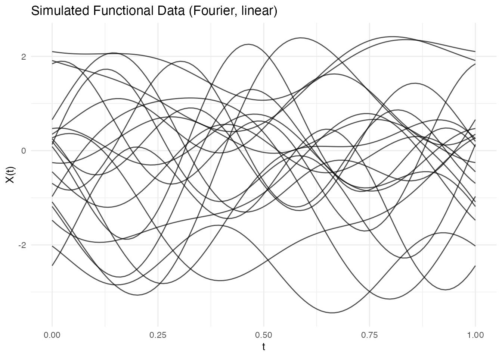

### Reproducibility

Set a seed for reproducible results:

``` r
fd1 <- simFunData(n = 5, argvals = t, M = 5, seed = 123)
fd2 <- simFunData(n = 5, argvals = t, M = 5, seed = 123)

# Verify they're identical
all.equal(fd1$data, fd2$data)
#> [1] TRUE
```

## Eigenfunction Bases

The shape of simulated curves depends on the eigenfunction basis. Use
[`eFun()`](https://sipemu.github.io/fdars/reference/eFun.md) to generate
different types.

### Fourier Basis

Best for periodic or smooth oscillating data:

``` r
phi_fourier <- eFun(t, M = 5, type = "Fourier")
matplot(t, phi_fourier, type = "l", lty = 1, lwd = 2,
        main = "Fourier Eigenfunctions", xlab = "t", ylab = expression(phi(t)))
legend("topright", paste0("k=", 1:5), col = 1:5, lty = 1)
```

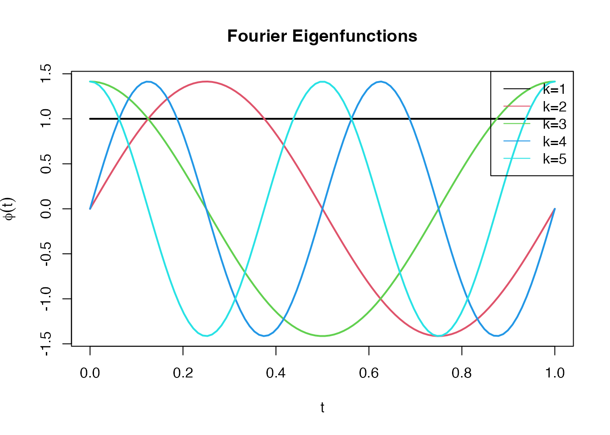

``` r
fd_fourier <- simFunData(n = 20, argvals = t, M = 5,
                         eFun.type = "Fourier", eVal.type = "exponential", seed = 42)
plot(fd_fourier, main = "Fourier Basis Simulation")
```

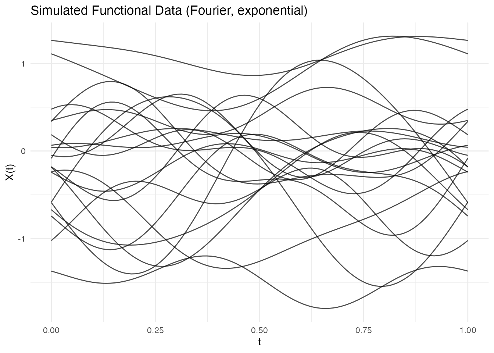

### Legendre Polynomials

Orthogonal polynomials on \[0, 1\]:

``` r
phi_poly <- eFun(t, M = 5, type = "Poly")
matplot(t, phi_poly, type = "l", lty = 1, lwd = 2,
        main = "Legendre Polynomial Eigenfunctions", xlab = "t", ylab = expression(phi(t)))
legend("topright", paste0("degree ", 0:4), col = 1:5, lty = 1)
```

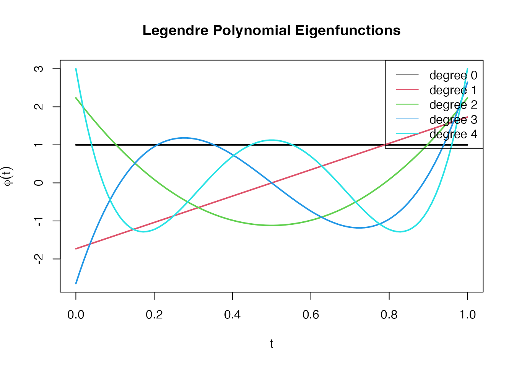

``` r
fd_poly <- simFunData(n = 20, argvals = t, M = 5,
                      eFun.type = "Poly", eVal.type = "exponential", seed = 42)
plot(fd_poly, main = "Polynomial Basis Simulation")
```

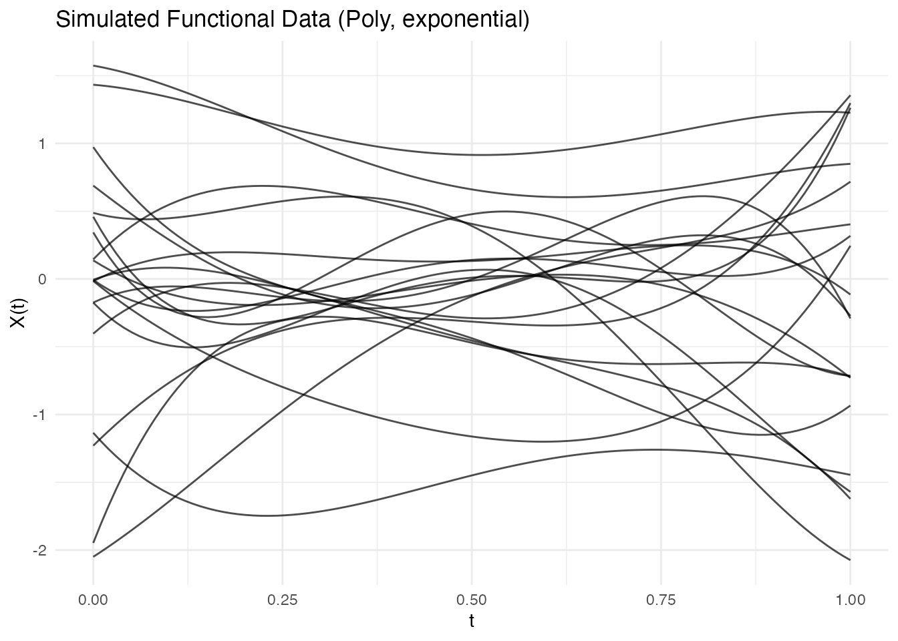

### Wiener Process Eigenfunctions

Eigenfunctions of Brownian motion covariance $K(s,t) = \min(s,t)$:

``` r
phi_wiener <- eFun(t, M = 5, type = "Wiener")
matplot(t, phi_wiener, type = "l", lty = 1, lwd = 2,
        main = "Wiener Process Eigenfunctions", xlab = "t", ylab = expression(phi(t)))
legend("topright", paste0("k=", 1:5), col = 1:5, lty = 1)
```

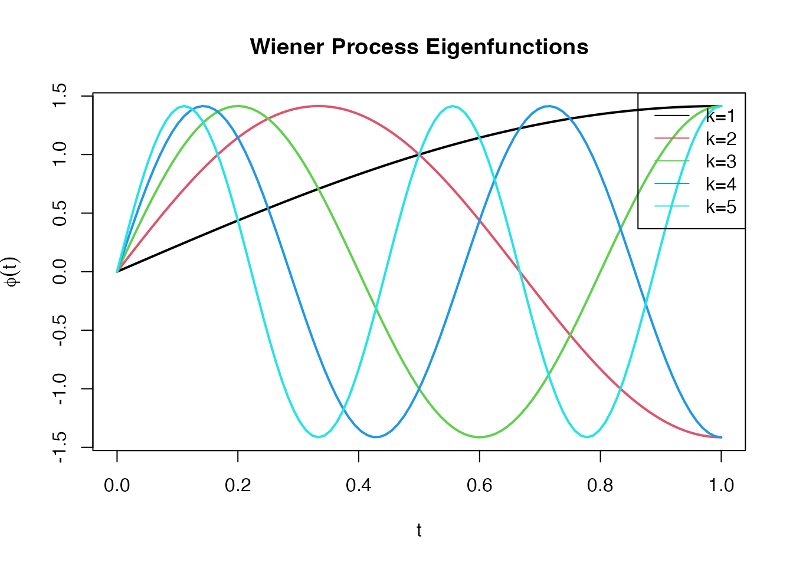

``` r
fd_wiener <- simFunData(n = 20, argvals = t, M = 10,
                        eFun.type = "Wiener", eVal.type = "wiener", seed = 42)
plot(fd_wiener, main = "Wiener Process Simulation")
```

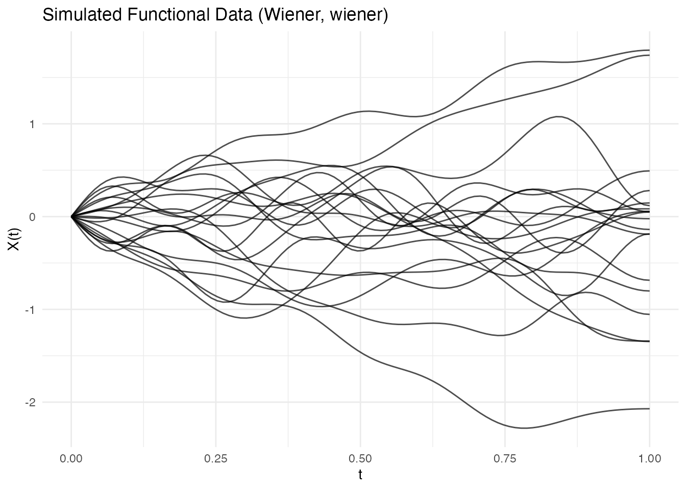

## Eigenvalue Decay

The eigenvalue sequence controls how much each mode contributes to
variance.

### Comparing Decay Patterns

``` r
M <- 20
lambda_lin <- eVal(M, "linear")      # lambda_k = 1/k
lambda_exp <- eVal(M, "exponential") # lambda_k = exp(-k)
lambda_wie <- eVal(M, "wiener")      # lambda_k = 1/((k-0.5)*pi)^2

df_evals <- data.frame(
  k = rep(1:M, 3),
  lambda = c(lambda_lin, lambda_exp, lambda_wie),
  type = rep(c("Linear", "Exponential", "Wiener"), each = M)
)

ggplot(df_evals, aes(x = k, y = lambda, color = type)) +
  geom_line(linewidth = 1) +
  geom_point() +
  scale_y_log10() +
  labs(title = "Eigenvalue Decay Patterns",
       x = "Mode k", y = expression(lambda[k]),
       color = "Decay Type") +
  theme(legend.position = "right")
```


### Effect on Curve Smoothness

Faster decay = smoother curves (higher modes contribute less):

``` r
par(mfrow = c(2, 1))

# Linear decay - rougher curves
fd_lin <- simFunData(n = 10, argvals = t, M = 10,
                     eFun.type = "Fourier", eVal.type = "linear", seed = 42)
plot(fd_lin, main = "Linear Decay (Rougher)")
```

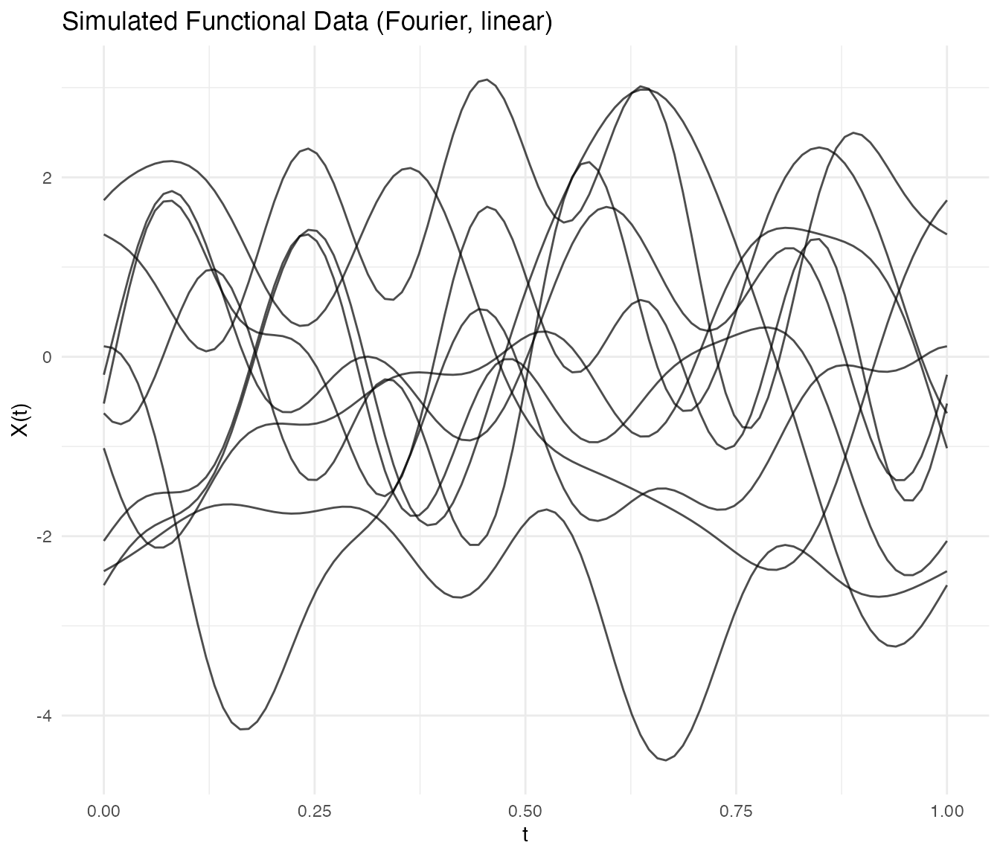

``` r

# Exponential decay - smoother curves
fd_exp <- simFunData(n = 10, argvals = t, M = 10,
                     eFun.type = "Fourier", eVal.type = "exponential", seed = 42)
plot(fd_exp, main = "Exponential Decay (Smoother)")
```

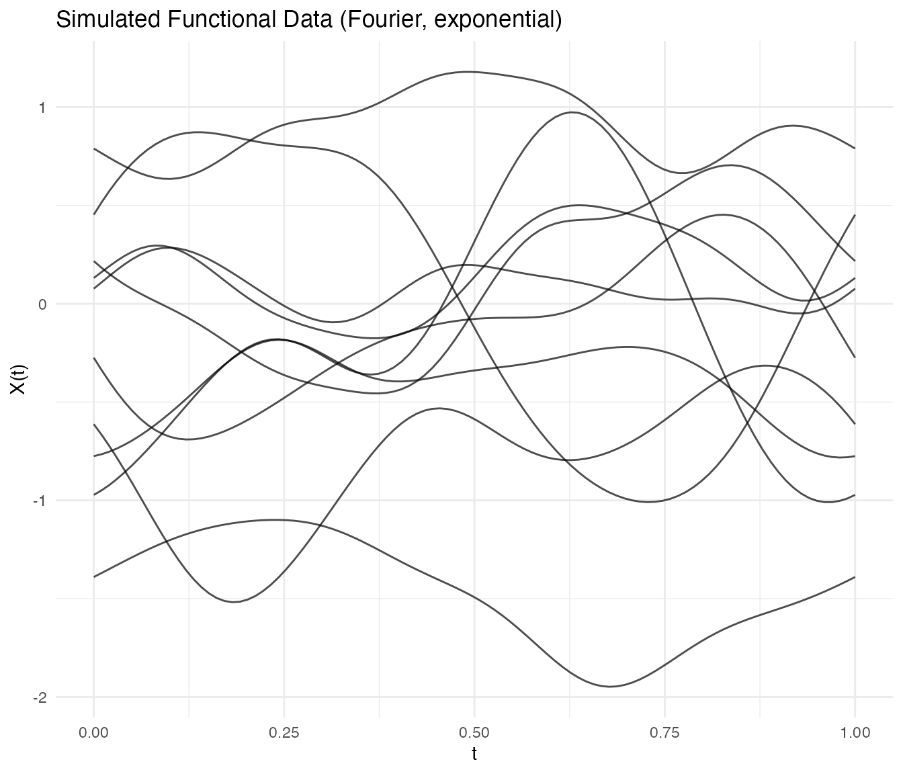

``` r

par(mfrow = c(1, 1))
```

## Adding Mean Function

Simulate data with a specified mean:

``` r
# Define mean function
mean_fn <- function(t) 2 * sin(2 * pi * t) + t

# Simulate with mean
fd_mean <- simFunData(n = 30, argvals = t, M = 5, mean = mean_fn, seed = 42)

# Visualize with ggplot2
mean_df <- data.frame(t = t, mean = mean_fn(t))
autoplot(fd_mean) +
  geom_line(data = mean_df, aes(x = t, y = mean), color = "red", linewidth = 1.5, inherit.aes = FALSE) +
  labs(title = "Simulated Data with Sinusoidal Mean")
```


## Adding Measurement Error

Use [`addError()`](https://sipemu.github.io/fdars/reference/addError.md)
to add noise to simulated (or real) data:

``` r
fd_clean <- simFunData(n = 10, argvals = t, M = 5, seed = 42)

par(mfrow = c(2, 2))

plot(fd_clean, main = "Clean Data")
```

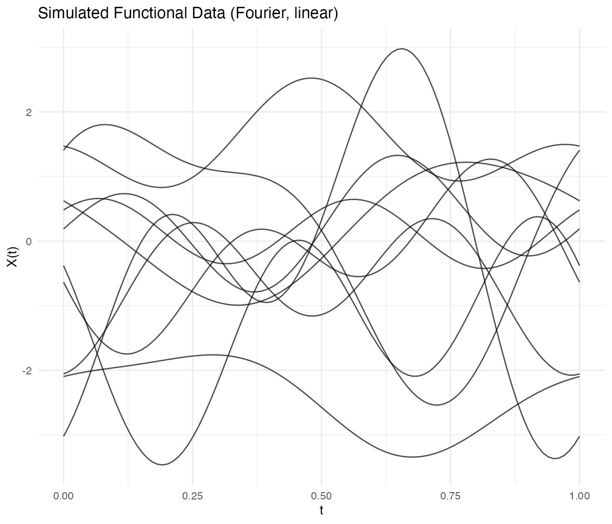

``` r

# Low noise
fd_low <- addError(fd_clean, sd = 0.1, seed = 123)
plot(fd_low, main = "Low Noise (sd = 0.1)")
```

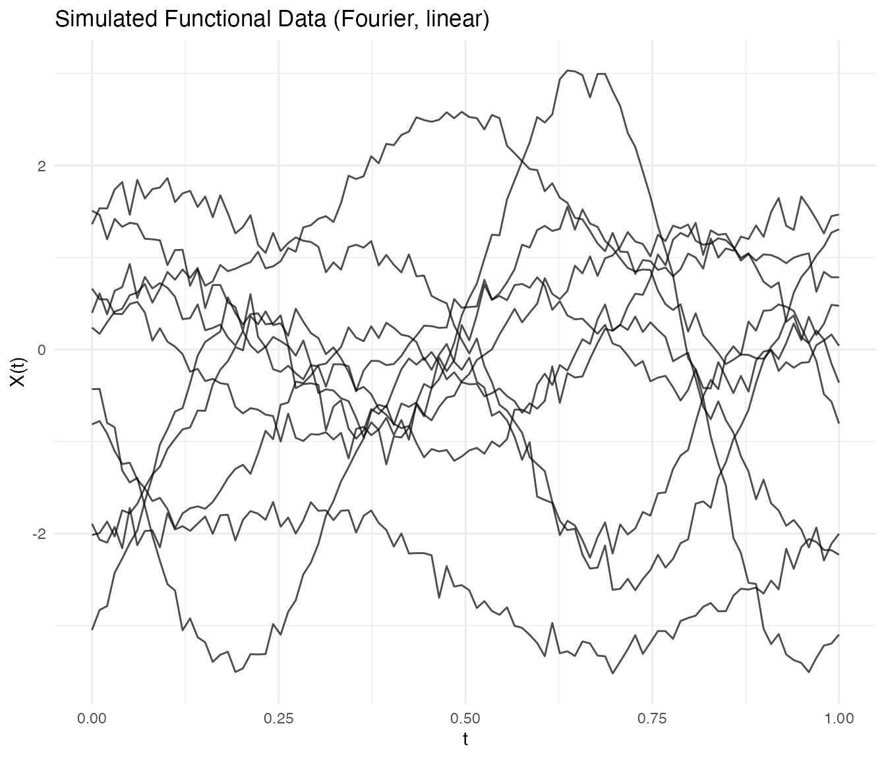

``` r

# Medium noise
fd_med <- addError(fd_clean, sd = 0.3, seed = 123)
plot(fd_med, main = "Medium Noise (sd = 0.3)")
```

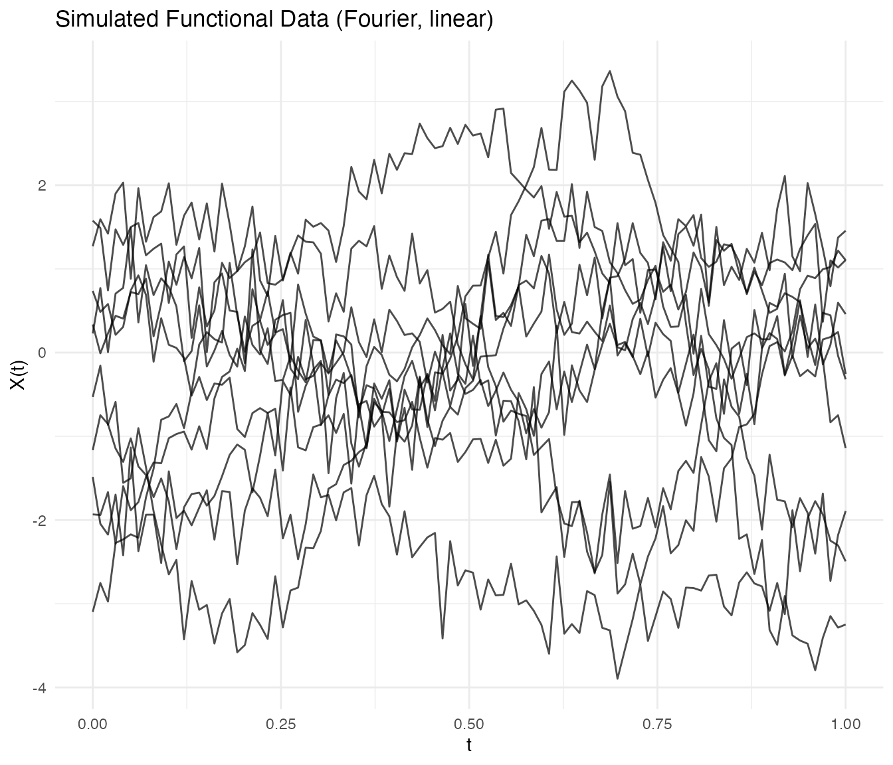

``` r

# High noise
fd_high <- addError(fd_clean, sd = 0.5, seed = 123)
plot(fd_high, main = "High Noise (sd = 0.5)")
```

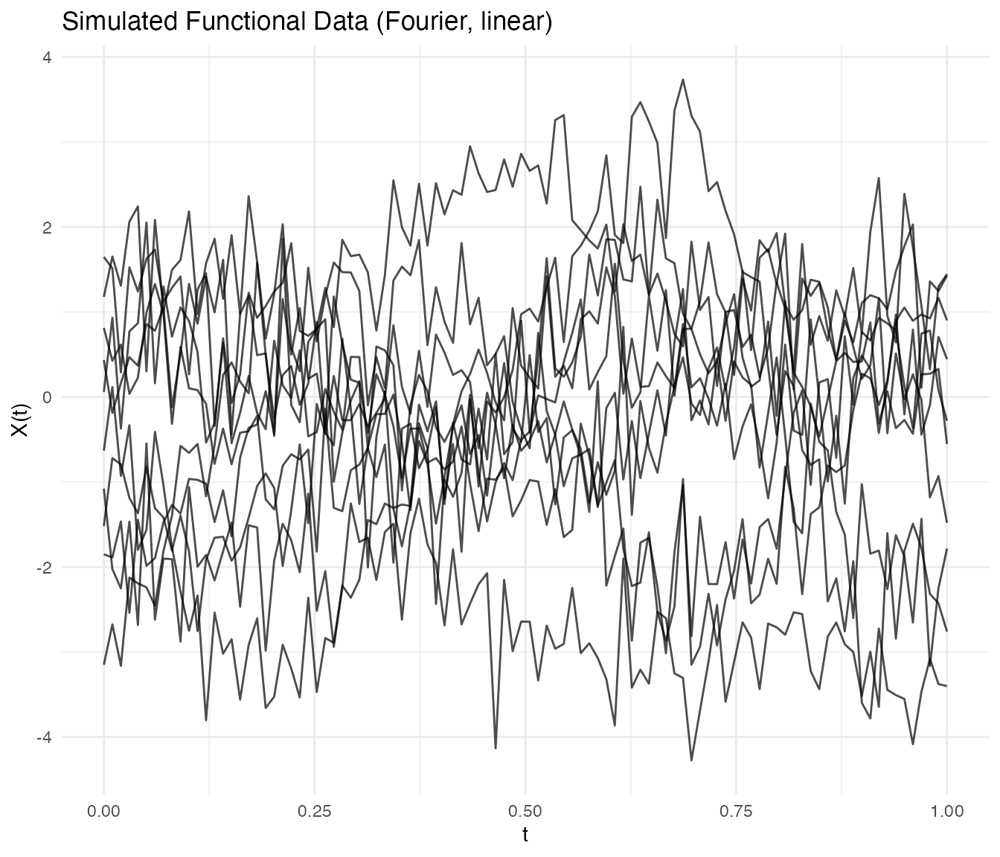

``` r

par(mfrow = c(1, 1))
```

### Curve-Level Noise

Add a constant noise value per curve (useful for modeling measurement
bias):

``` r
fd_curve_noise <- addError(fd_clean, sd = 0.5, type = "curve", seed = 123)
plot(fd_curve_noise, main = "Curve-Level Noise")
```

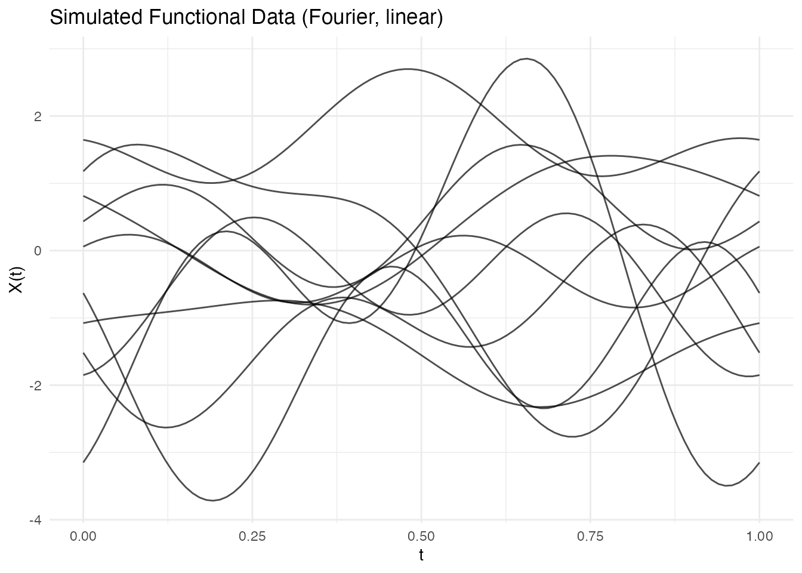

## Creating Sparse/Irregular Data

Use [`sparsify()`](https://sipemu.github.io/fdars/reference/sparsify.md)
to simulate irregular sampling:

``` r
fd <- simFunData(n = 10, argvals = t, M = 5, seed = 42)

# Create sparse version
ifd <- sparsify(fd, minObs = 10, maxObs = 30, seed = 123)
print(ifd)
#> Irregular Functional Data Object
#> =================================
#>   Number of observations: 10 
#>   Points per curve:
#>     Min: 10 
#>     Median: 21.5 
#>     Max: 29 
#>     Total: 212 
#>   Domain: [ 0 , 1 ]
```

``` r
plot(ifd, main = "Sparsified Functional Data")
```

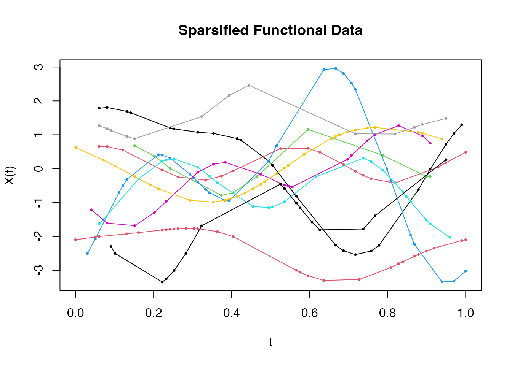

See the “Irregular Sampling” vignette for more details on working with
sparse data.

## Multivariate Functional Data

Simulate multiple correlated functional components:

``` r
t1 <- seq(0, 1, length.out = 100)
t2 <- seq(0, 0.5, length.out = 50)

mfd <- simMultiFunData(
  n = 15,
  argvals = list(t1, t2),
  M = c(5, 3),
  eFun.type = c("Fourier", "Wiener"),
  eVal.type = c("exponential", "linear"),
  seed = 42
)

print(mfd)
#> Multivariate Functional Data Object
#> ===================================
#>   Number of observations: 15 
#>   Number of components: 2 
#> 
#>   Component 1 :
#>     Evaluation points: 100 
#>     Domain: [ 0 , 1 ]
#>   Component 2 :
#>     Evaluation points: 50 
#>     Domain: [ 0 , 0.5 ]
```

``` r
par(mfrow = c(2, 1))
plot(mfd$components[[1]], main = "Component 1 (Fourier)")
```


``` r
plot(mfd$components[[2]], main = "Component 2 (Wiener)")
```

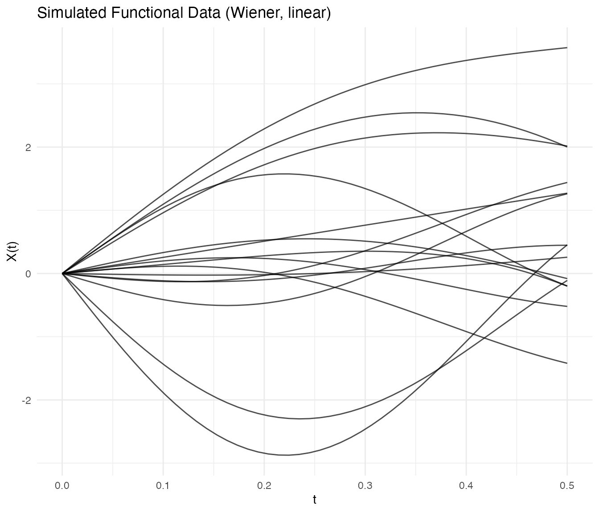

``` r
par(mfrow = c(1, 1))
```

## Comparison with GP Simulation

The package also offers Gaussian Process simulation via
[`make_gaussian_process()`](https://sipemu.github.io/fdars/reference/make_gaussian_process.md):

| Aspect         | KL (`simFunData`)           | GP (`make_gaussian_process`) |
|----------------|-----------------------------|------------------------------|
| Control        | Eigenfunctions, eigenvalues | Covariance kernel            |
| Interpretation | Modal decomposition         | Correlation structure        |
| Best for       | Known FPCA structure        | Known covariance kernel      |
| Computation    | O(nM) per curve             | O(m³) for Cholesky           |

``` r
par(mfrow = c(2, 1))

# KL simulation
fd_kl <- simFunData(n = 10, argvals = t, M = 10,
                    eFun.type = "Wiener", eVal.type = "wiener", seed = 42)
plot(fd_kl, main = "KL Simulation (Wiener)")
```

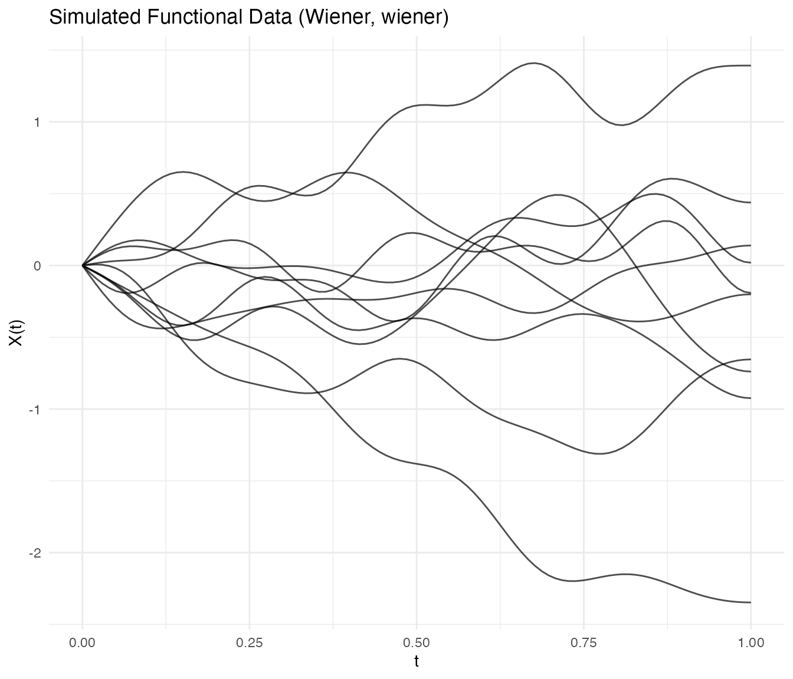

``` r

# GP simulation with Brownian motion kernel
set.seed(42)
fd_gp <- make_gaussian_process(n = 10, t = t,
                                cov = kernel_brownian())
plot(fd_gp, main = "GP Simulation (Brownian Kernel)")
```

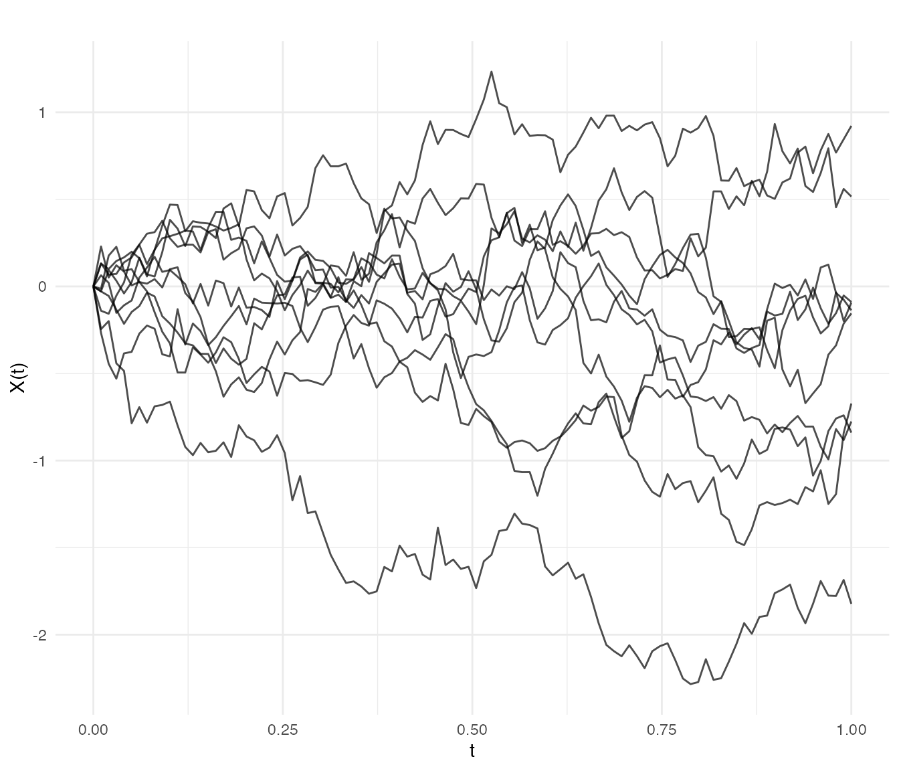

``` r

par(mfrow = c(1, 1))
```

## Complete Simulation Recipe

Here’s a complete workflow for power analysis:

``` r
set.seed(42)

# 1. Simulate two groups with different means
n_per_group <- 30
t <- seq(0, 1, length.out = 100)

mean_group1 <- function(t) sin(2 * pi * t)
mean_group2 <- function(t) sin(2 * pi * t) + 0.5 * cos(4 * pi * t)

group1 <- simFunData(n = n_per_group, argvals = t, M = 5, mean = mean_group1)
group2 <- simFunData(n = n_per_group, argvals = t, M = 5, mean = mean_group2)

# 2. Add measurement noise
group1 <- addError(group1, sd = 0.2)
group2 <- addError(group2, sd = 0.2)

# 3. Visualize with ggplot2
mean_df1 <- data.frame(t = t, mean = mean_group1(t))
mean_df2 <- data.frame(t = t, mean = mean_group2(t))

p1 <- autoplot(group1, alpha = 0.5) +
  geom_line(data = mean_df1, aes(x = t, y = mean), color = "blue", linewidth = 1.5, inherit.aes = FALSE) +
  labs(title = "Group 1")

p2 <- autoplot(group2, alpha = 0.5) +
  geom_line(data = mean_df2, aes(x = t, y = mean), color = "red", linewidth = 1.5, inherit.aes = FALSE) +
  labs(title = "Group 2")

# Side-by-side plots
gridExtra::grid.arrange(p1, p2, ncol = 2)
```


## Summary

| Function                                                                                                                                                                                                     | Purpose                                                     |
|--------------------------------------------------------------------------------------------------------------------------------------------------------------------------------------------------------------|-------------------------------------------------------------|
| [`simFunData()`](https://sipemu.github.io/fdars/reference/simFunData.md)                                                                                                                                     | KL simulation with specified eigenfunctions/eigenvalues     |
| [`simMultiFunData()`](https://sipemu.github.io/fdars/reference/simMultiFunData.md)                                                                                                                           | Multivariate functional data simulation                     |
| [`eFun()`](https://sipemu.github.io/fdars/reference/eFun.md)                                                                                                                                                 | Generate eigenfunction bases (Fourier, Poly, Wiener)        |
| [`eVal()`](https://sipemu.github.io/fdars/reference/eVal.md)                                                                                                                                                 | Generate eigenvalue sequences (linear, exponential, wiener) |
| [`addError()`](https://sipemu.github.io/fdars/reference/addError.md)                                                                                                                                         | Add Gaussian noise (pointwise or curve-level)               |
| [`sparsify()`](https://sipemu.github.io/fdars/reference/sparsify.md)                                                                                                                                         | Create irregular/sparse data from regular                   |
| [`make_gaussian_process()`](https://sipemu.github.io/fdars/reference/make_gaussian_process.md)                                                                                                               | GP simulation with covariance kernels                       |
| [`r.brownian()`](https://sipemu.github.io/fdars/reference/r.brownian.md), [`r.ou()`](https://sipemu.github.io/fdars/reference/r.ou.md), [`r.bridge()`](https://sipemu.github.io/fdars/reference/r.bridge.md) | Specific random process generators                          |
