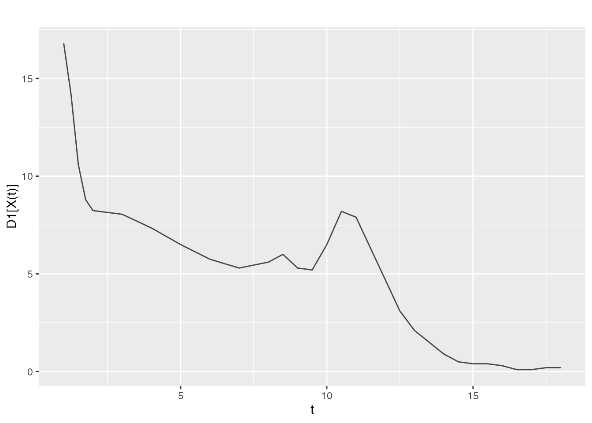
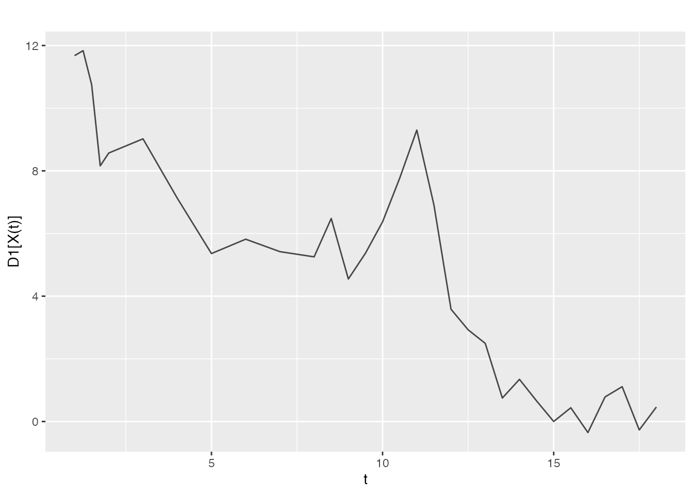
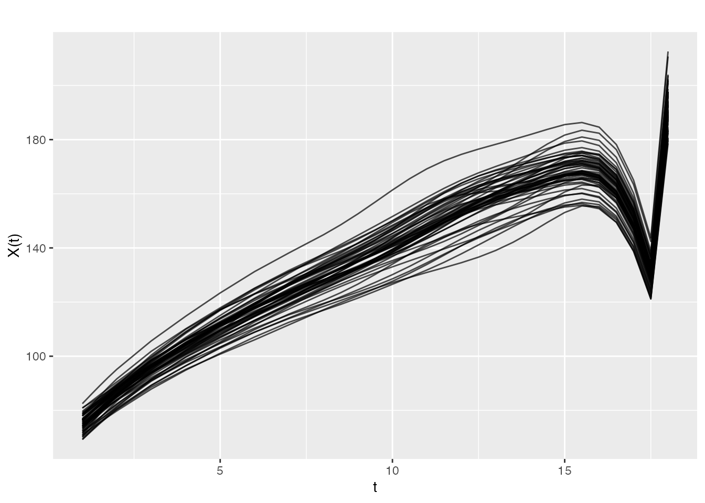
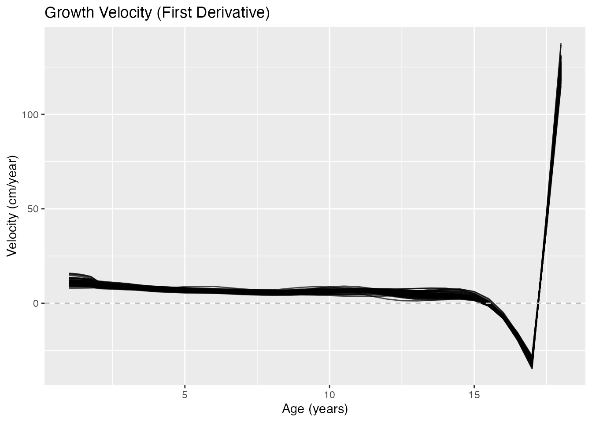
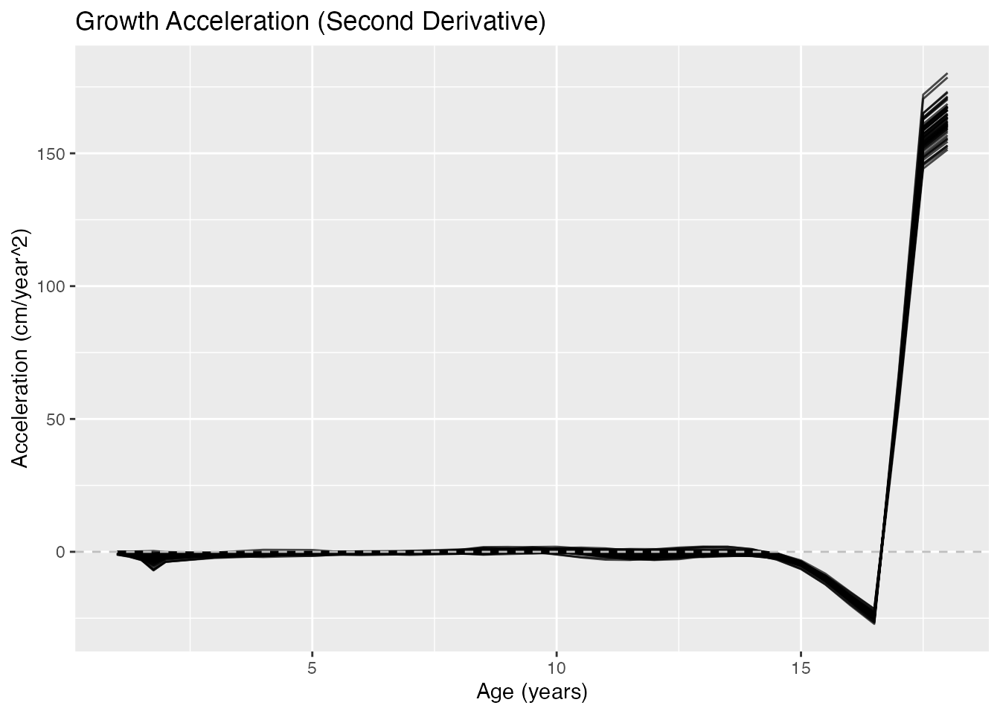
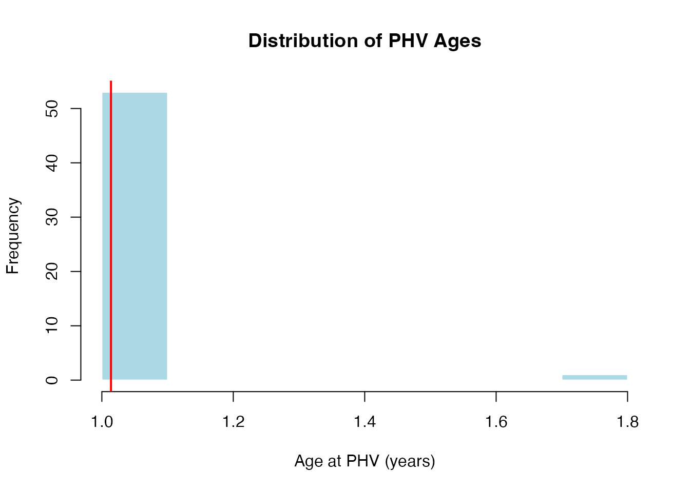
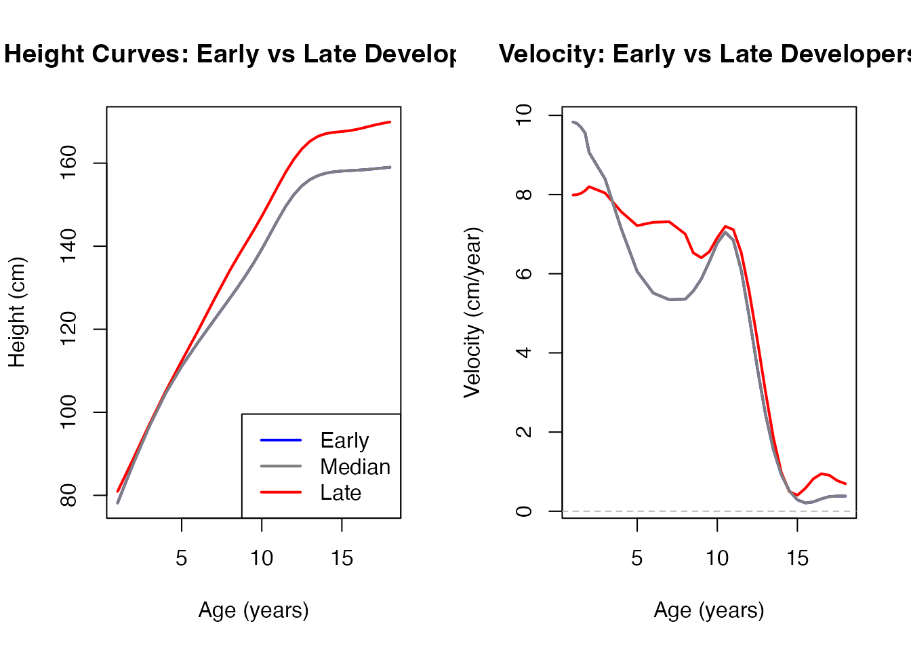
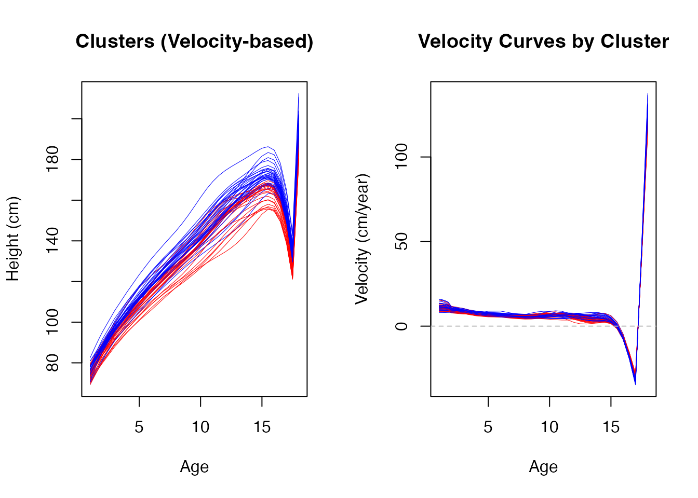

# Working with Derivatives

## Why Derivatives Matter in FDA

In functional data analysis, derivatives reveal critical information
that the original curves may hide:

- **Velocity**: First derivative shows rate of change
- **Acceleration**: Second derivative shows how the rate itself changes
- **Curvature**: Related to second derivative, shows bending of curves
- **Phase variation**: Timing of events (peaks, valleys) across subjects

Many real-world questions are about *when* and *how fast* things change,
not just *what* values are observed.

``` r
library(fdars)
#> 
#> Attaching package: 'fdars'
#> The following objects are masked from 'package:stats':
#> 
#>     cov, deriv, median, sd, var
#> The following object is masked from 'package:base':
#> 
#>     norm
set.seed(42)
```

## Loading Growth Data

The Berkeley Growth Study is ideal for demonstrating derivatives: -
**Height curves** show overall growth pattern - **Velocity (1st
derivative)** reveals growth spurts - **Acceleration (2nd derivative)**
shows onset and end of spurts

``` r
# Load or simulate growth data
if (requireNamespace("fda", quietly = TRUE)) {
  data(growth, package = "fda")
  age <- growth$age
  heights <- t(growth$hgtf)  # Girls' heights
  n <- nrow(heights)
} else {
  message("Install 'fda' package for real data: install.packages('fda')")
  # Simulate growth-like data
  age <- seq(1, 18, length.out = 31)
  n <- 20
  heights <- matrix(0, n, length(age))
  for (i in 1:n) {
    A <- rnorm(1, 170, 5)
    b <- rnorm(1, 2.5, 0.2)
    c <- rnorm(1, 0.15, 0.02)
    heights[i, ] <- A * exp(-b * exp(-c * age)) + rnorm(length(age), sd = 0.5)
  }
}

fd <- fdata(heights, argvals = age)
cat("Loaded", n, "growth curves from ages", min(age), "to", max(age), "\n")
#> Loaded 54 growth curves from ages 1 to 18
```

## The Problem: Noise Amplifies with Differentiation

Let’s see what happens when we naively differentiate noisy data:

``` r
# Add some measurement noise
heights_noisy <- heights + matrix(rnorm(length(heights), sd = 1), nrow = n)
fd_noisy <- fdata(heights_noisy, argvals = age)

# Compute derivative of noisy data
fd_deriv_noisy <- deriv(fd_noisy, nderiv = 1)

# Compare to original derivative
fd_deriv <- deriv(fd, nderiv = 1)

par(mfrow = c(1, 2))
plot(fd_deriv[1, ], main = "Velocity (Original Data)",
     xlab = "Age", ylab = "cm/year", ylim = c(-2, 15))
```



``` r
plot(fd_deriv_noisy[1, ], main = "Velocity (Noisy Data)",
     xlab = "Age", ylab = "cm/year", ylim = c(-2, 15))
```



``` r
par(mfrow = c(1, 1))
```

The noise in measurements becomes dramatically amplified in derivatives!

## Solution: Smooth Before Differentiating

The key insight: **Always smooth your data before computing
derivatives**.

P-splines are excellent for this because they provide smooth
derivatives:

``` r
# Smooth the noisy data with P-splines
fd_smooth <- pspline(fd_noisy)

# Now compute derivatives from smoothed data
fd_velocity <- deriv(fd_smooth$fdata, nderiv = 1)
fd_acceleration <- deriv(fd_smooth$fdata, nderiv = 2)
```

## Understanding Growth Derivatives

### Height Curves (Original)

``` r
plot(fd_smooth$fdata, main = "Smoothed Height Curves",
     xlab = "Age (years)", ylab = "Height (cm)")
```



### Velocity Curves (First Derivative)

Velocity shows the growth rate in cm/year. The pubertal growth spurt is
clearly visible as a peak around age 11-13:

``` r
library(ggplot2)
plot(fd_velocity) +
  geom_hline(yintercept = 0, linetype = 2, color = "gray") +
  labs(title = "Growth Velocity (First Derivative)",
       x = "Age (years)", y = "Velocity (cm/year)")
```



Key observations: - **Infancy**: Very high velocity (children grow
fast) - **Childhood**: Gradual decline to ~5 cm/year - **Puberty**:
Sharp peak (the growth spurt) - **Adulthood**: Velocity approaches zero
(growth stops)

### Acceleration Curves (Second Derivative)

Acceleration shows when growth speeds up (positive) or slows down
(negative):

``` r
plot(fd_acceleration) +
  geom_hline(yintercept = 0, linetype = 2, color = "gray") +
  labs(title = "Growth Acceleration (Second Derivative)",
       x = "Age (years)", y = "Acceleration (cm/year^2)")
```



Key observations: - **Zero crossing (positive to negative)**: Peak of
growth spurt (PHV - Peak Height Velocity) - **Minimum acceleration**:
Most rapid deceleration of growth

## Finding Important Events

### Peak Height Velocity (PHV)

The age of peak height velocity is an important biological marker:

``` r
# Find age of maximum velocity for each individual
phv_ages <- apply(fd_velocity$data, 1, function(v) {
  age[which.max(v)]
})

# Summary statistics
cat("Peak Height Velocity Ages:\n")
#> Peak Height Velocity Ages:
cat("  Mean:", round(mean(phv_ages), 1), "years\n")
#>   Mean: 1 years
cat("  SD:", round(sd(phv_ages), 1), "years\n")
#>   SD: 0.1 years
cat("  Range:", round(min(phv_ages), 1), "-", round(max(phv_ages), 1), "years\n")
#>   Range: 1 - 1.8 years

# Histogram
hist(phv_ages, breaks = 10, col = "lightblue", border = "white",
     main = "Distribution of PHV Ages", xlab = "Age at PHV (years)")
abline(v = mean(phv_ages), col = "red", lwd = 2)
```



### Visualizing Individual Variation

``` r
# Select early and late developers
early_idx <- which.min(phv_ages)
late_idx <- which.max(phv_ages)
median_idx <- which.min(abs(phv_ages - median(phv_ages)))

par(mfrow = c(1, 2))

# Height curves
plot(age, fd_smooth$fdata$data[early_idx, ], type = "l", col = "blue", lwd = 2,
     ylim = range(fd_smooth$fdata$data[c(early_idx, late_idx, median_idx), ]),
     main = "Height Curves: Early vs Late Developers",
     xlab = "Age (years)", ylab = "Height (cm)")
lines(age, fd_smooth$fdata$data[late_idx, ], col = "red", lwd = 2)
lines(age, fd_smooth$fdata$data[median_idx, ], col = "gray50", lwd = 2)
legend("bottomright", c("Early", "Median", "Late"),
       col = c("blue", "gray50", "red"), lwd = 2)

# Velocity curves
plot(age, fd_velocity$data[early_idx, ], type = "l", col = "blue", lwd = 2,
     ylim = range(fd_velocity$data[c(early_idx, late_idx, median_idx), ]),
     main = "Velocity: Early vs Late Developers",
     xlab = "Age (years)", ylab = "Velocity (cm/year)")
lines(age, fd_velocity$data[late_idx, ], col = "red", lwd = 2)
lines(age, fd_velocity$data[median_idx, ], col = "gray50", lwd = 2)
abline(h = 0, lty = 2, col = "gray")
```



``` r

par(mfrow = c(1, 1))
```

## Derivative-Based Distances

The shape of velocity or acceleration curves may be more meaningful for
comparing individuals than the height curves themselves.

### Using semimetric.deriv()

``` r
# Distance based on first derivative (velocity)
dist_height <- metric.lp(fd_smooth$fdata)
dist_velocity <- semimetric.deriv(fd_smooth$fdata, nderiv = 1)
dist_acceleration <- semimetric.deriv(fd_smooth$fdata, nderiv = 2)

# Compare distance matrices (first 10 individuals)
cat("Correlation between distance types:\n")
#> Correlation between distance types:
cat("  Height vs Velocity:", round(cor(as.vector(dist_height[1:10, 1:10]),
                                        as.vector(dist_velocity[1:10, 1:10])), 3), "\n")
#>   Height vs Velocity: 0.673
cat("  Height vs Acceleration:", round(cor(as.vector(dist_height[1:10, 1:10]),
                                            as.vector(dist_acceleration[1:10, 1:10])), 3), "\n")
#>   Height vs Acceleration: 0.452
```

### Clustering by Growth Pattern

Different distance measures can reveal different groupings:

``` r
# Cluster using velocity-based distance (semimetric.deriv as the metric function)
km_velocity <- cluster.kmeans(fd_smooth$fdata, ncl = 2,
                               metric = semimetric.deriv, nderiv = 1, seed = 123)

# Visualize clusters
par(mfrow = c(1, 2))

# Height by cluster
plot(age, fd_smooth$fdata$data[1, ], type = "n",
     ylim = range(fd_smooth$fdata$data),
     main = "Clusters (Velocity-based)",
     xlab = "Age", ylab = "Height (cm)")
for (i in 1:n) {
  lines(age, fd_smooth$fdata$data[i, ],
        col = ifelse(km_velocity$cluster[i] == 1, "blue", "red"), lwd = 0.5)
}

# Velocity by cluster
plot(age, fd_velocity$data[1, ], type = "n",
     ylim = range(fd_velocity$data),
     main = "Velocity Curves by Cluster",
     xlab = "Age", ylab = "Velocity (cm/year)")
for (i in 1:n) {
  lines(age, fd_velocity$data[i, ],
        col = ifelse(km_velocity$cluster[i] == 1, "blue", "red"), lwd = 0.5)
}
abline(h = 0, lty = 2, col = "gray")
```



``` r

par(mfrow = c(1, 1))
```

## 2D Functional Data: Partial Derivatives

For surfaces (2D functional data), we compute partial derivatives:

``` r
# Create a simple 2D example: temperature surface (space x time)
s <- seq(0, 1, length.out = 20)  # spatial coordinate
t <- seq(0, 1, length.out = 25)  # time coordinate

# Generate surface: wave pattern
Z <- outer(s, t, function(x, y) sin(2*pi*x) * cos(2*pi*y) + 0.1*rnorm(length(x)))

# Create 2D fdata
fd2d <- fdata(Z, argvals = list(s = s, t = t), fdata2d = TRUE)

# Partial derivatives
# Note: For 2D data, use nderiv parameter to specify derivative type
# nderiv = 1 for ds, nderiv = 2 for dt, etc.
```

## Optimal Smoothing for Derivatives

When the goal is to estimate derivatives, we may need different
smoothing than for the curves themselves. Higher penalty (more
smoothing) often gives better derivative estimates:

``` r
# Compare different smoothing levels
lambdas <- c(0.01, 0.1, 1, 10)

par(mfrow = c(2, 2))
idx <- 1

for (lam in lambdas) {
  fd_s <- pspline(fd_noisy, lambda = lam)
  fd_v <- deriv(fd_s$fdata, nderiv = 1)

  plot(age, fd_v$data[idx, ], type = "l", col = "blue", lwd = 2,
       main = bquote(lambda == .(lam)),
       xlab = "Age", ylab = "Velocity")
  lines(age, fd_deriv$data[idx, ], col = "red", lty = 2)
  abline(h = 0, lty = 3, col = "gray")
}
```


``` r
par(mfrow = c(1, 1))
```

## Practical Workflow

Here’s a recommended workflow for derivative analysis:

``` r
# 1. Load and inspect raw data
cat("Step 1: Inspect raw data\n")
#> Step 1: Inspect raw data
summary(fd)
#> Functional data summary
#> =======================
#> Type: 1D (curve) 
#> Number of observations: 54 
#> Number of evaluation points: 31 
#> 
#> Data range:
#>   Min: 67.3 
#>   Max: 183.2 
#>   Mean: 135.1664 
#>   SD: 31.28565

# 2. Smooth with appropriate method
cat("\nStep 2: Smooth data (P-splines)\n")
#> 
#> Step 2: Smooth data (P-splines)
fd_smooth <- pspline(fd, lambda = NULL)  # NULL = automatic selection

# 3. Compute derivatives
cat("\nStep 3: Compute derivatives\n")
#> 
#> Step 3: Compute derivatives
fd_d1 <- deriv(fd_smooth$fdata, nderiv = 1)
fd_d2 <- deriv(fd_smooth$fdata, nderiv = 2)

# 4. Extract features from derivatives
cat("\nStep 4: Extract features\n")
#> 
#> Step 4: Extract features
features <- data.frame(
  id = 1:n,
  max_velocity = apply(fd_d1$data, 1, max),
  age_at_max_vel = apply(fd_d1$data, 1, function(v) age[which.max(v)]),
  min_acceleration = apply(fd_d2$data, 1, min)
)
head(features)
#>   id max_velocity age_at_max_vel min_acceleration
#> 1  1     15.61790            1.0        -9.683712
#> 2  2     16.59168            1.5       -19.500398
#> 3  3     15.98360            1.0       -10.561677
#> 4  4     13.05737            1.5        -7.280834
#> 5  5     14.80809            1.0        -9.408322
#> 6  6     16.82903            1.0       -10.610381

# 5. Use for further analysis
cat("\nStep 5: Use features for analysis\n")
#> 
#> Step 5: Use features for analysis
cat("Correlation between age at PHV and max velocity:",
    round(cor(features$age_at_max_vel, features$max_velocity), 3), "\n")
#> Correlation between age at PHV and max velocity: -0.301
```

## Summary

| Task                | Function                       | Notes                                     |
|---------------------|--------------------------------|-------------------------------------------|
| First derivative    | `deriv(fd, nderiv = 1)`        | Velocity, rate of change                  |
| Second derivative   | `deriv(fd, nderiv = 2)`        | Acceleration, curvature                   |
| Derivative distance | `semimetric.deriv(fd, nderiv)` | Shape-based comparison                    |
| Pre-smoothing       | `pspline(fd)`                  | **Always smooth before differentiating!** |

**Key Takeaways:**

1.  **Always smooth before computing derivatives** - noise amplifies
    dramatically
2.  **More smoothing for derivatives** - may need higher $\lambda$ than
    for curves
3.  **Derivatives reveal dynamics** - growth spurts, timing, phase
    variation
4.  **Derivative-based distances** - useful for shape-based clustering
    and comparison

## References

- Ramsay, J.O. and Silverman, B.W. (2005). *Functional Data Analysis*.
  Springer. (Chapter 5: Smoothing Functional Data; Chapter 9: Principal
  Differential Analysis)
- Tuddenham, R.D. and Snyder, M.M. (1954). Physical growth of California
  boys and girls from birth to eighteen years. *University of California
  Publications in Child Development*, 1, 183-364.
